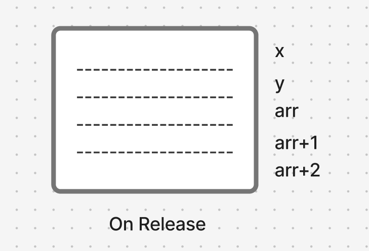
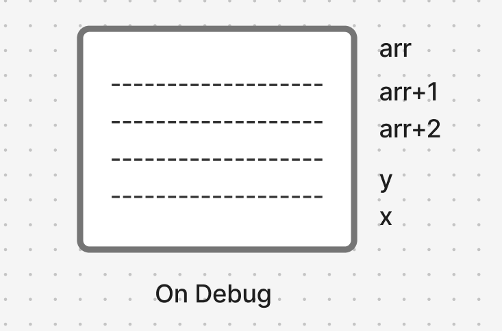

# What are Arrays?
An array is a collection of consecutive variables of the same datatype.
To define an array you type the `[datatype] [name of array][[number of vars]];`
like this:
`int arr[4];`
Array is a drift datatype like pointers. array is following the same memory management rules of storing variables, so if you define an array in `main()` function, its elements will be stored in the `stack`, if you made the array `static local` the elements will be stored in the `.bss` memory segment. 
The name of the array is the memory address of the first byte of the first element in the array, just like the function name.
The size of the array is the datatype of the array multiplied by the number of elements in it.
If you initialized the array with a non-zero value it will be stored in the `.data` memory segment.

Initializing arrays during declaration:
```c
int arr[4]={14,20,15,10}; // valid
int arr[]={14,20,15,10};  // valid
// Compiler counts how many elements and assigns the value according to that size
```
So, if this array was local or static local or static global it would be stored in the `.data` memory segment.
## What happens if you assign more elements?

```c
int arr[4] = {1,2,3,4,5};
```
In most IDEs, the program gives a syntax error but, in CodeBlocks it just gives a warning and neglects the extra element.
## What happens if you assign fewer elements?
```c
int arr[5] = {1,2,3};
```
The compiler zeroes the rest of the elements so it will be like this:
```c
int arr[5] = {1,2,3,0,0};
```
# Accessing Arrays
Arrays can be accessed by the same subscriptor operator we talked about earlier:
`arr[2];`, the number 2 is the index, the index of the number is the order of that number - 1 due to starting from zero.
```c
int arr[5] = {1,2,3,4,5};
printf("%i", arr[2]);
```
Output:
```
3
```

As we talked earlier, the name of the array is a pointer to the address of the first element, So we can access it using pointers' syntax:
```c
printf("%i", *(arr+2));
```
Notice here that if you are adding 2 on the array name, the step of it is the elements' datatype byte size, which means that in our case we are not sent to the third byte in the first element as the step is not only 1 byte, It will be pointing to the third element.
# Name of the array
The name of the array is a const pointer to the first element but it is not a total pointer as it is considered as an identifier. We can not describe it as a total real pointer as pointers have a physical place in the memory while the name of the array doesn't,
# Least Index, Least Address
If you remember we demonstrated earlier that the stack gets inverted from debug mode to release mode, although it doesn't differ with arrays, arrays are treated from the compiler as a whole.
## Release mode
```c
int main() {
	int x,y, arr[3];
}
```
Reserving memory for variables in release mode is from up to down.
So, It is something like this:

## Debug mode
```c
int main() {
	int x,y arr[3];
}
```
Reserving variables inside stack here is reversed upside down except for the array.
So, It is something like this:

# Designated Initialization
Imagine that you want to declare an array of size 11 where all elements are zeroed except for fourth and fifth elements are of 1
You can type it like this:
```c
int arr[11]={[3]=1, [4]=1};
```
so it be like `0 0 0 1 1 0 0 0 0 0 0`

But, What if I didn't put a size for the array?
```c
int arr[]={[3]=1, [4]=1};
```
The size of the array now will be 5, it will look for the greatest designated initialization number.
# Determining the size of an array
```c
int arr[] = {1,2,3,4,5,6};
// If you need to determine the size of the array:

printf("%i", sizeof(arr)); 
// This is not valide as it will outptut 24, the number of bytes of all elements.

printf("%i", sizeof(arr)/sizeof(arr[0])); 
// This is 24 divided by 4 giving us 6
```
Output:
```
24
6
```
# Array of pointers
You can define an array of pointers, where each element can hold up an address for a certain datatype.
```c
int x=2,y=12;
int *ptrArr[2] = {&x,&y};
printf("%i\n", ptrArr[1]);
printf("%i\n", *ptrArr[1]); 
```
Output:
```
6356732
12
```
It has the same properties of a normal array and a normal pointer.

Do not forget that the name of the array is a pointer itself to the first byte of the first array, so we can say that this array is a pointer to pointers
```c
#include <stdio.h>

int main() {
    int x=2,y=12;
    int *ptrArr[2] = {&x,&y};
	
	printf("%i\n", &ptrArr[1]);          // Address of the second element 
    printf("%i\n\n", ptrArr+1);          // Address of the second element
    // This the address of the pointer holding the address of y
    
    printf("%i\n", ptrArr[1]);           // Address of y
    printf("%i\n\n", *(ptrArr+1));       // Address of y
	// Dereferencing the address of the array + 1 step
	
    printf("%i\n", *ptrArr[1]);          // Value of y
    printf("%i\n", **(ptrArr+1));        // Value of y
    // Dereferencing the address of the value hold by the second element 
}
```
Output:
```
6356724
6356724

6356728
6356728

12
12
```
# Array of pointers to function
The syntax is like that:
```c
int (*ptr[2]) (int, int);
```
This is an array holding to pointers, each one is pointing to a function that takes 2 integers and return an integer.
So, in every index I can assign it into a function name (address of the function) to it.
```c
#include <stdio.h>

int sum(int,int);
int product(int,int);

int main() {
	int (*ptr[2]) (int, int);
	ptr[0]=sum;
	ptr[1]=product;
	
	printf("The sum is \n");
	printf("%i\n", (*ptr)(5,3));         // using dereferencing
	printf("%i\n\n", ptr[0](5,3));       // using subscriptors
	
	printf("The product is \n");
	printf("%i\n", (*(ptr+1))(5,3));     // using dereferencing
	printf("%i\n", ptr[1](5,3));         // using subscriptors
}

int sum(int x, int y) {
	return x+y;
}

int product(int x, int y) {
	return x*y;
}
```
Output:
```
The sum is
8
8

The product is
15
15
```
# Pointer to Array
We need first to understand precedence, the subscriptor operators has the precedence of the normal parenthesis, which means that they have higher precedence than unary operators like dereferencing operator.

So, if we typed:
```c
int *x[4];
```
The subscriptor operators (`[]`) has higher operator than dereferencing operator (`*`). So, We spell the subcriptor operator first - array - of a dereference of x - pointer - which means array of pointers.

But if we typed:
```c
int (*x)[4];
```
The subscriptor operators (`[]`) has the same precedence of the parenthesis (`()`), So, the compiler executes from the left to right, We spell the dereference operator - pointer - first, then we spell the subscriptor operators - array - which means a pointer to array.
25:00
