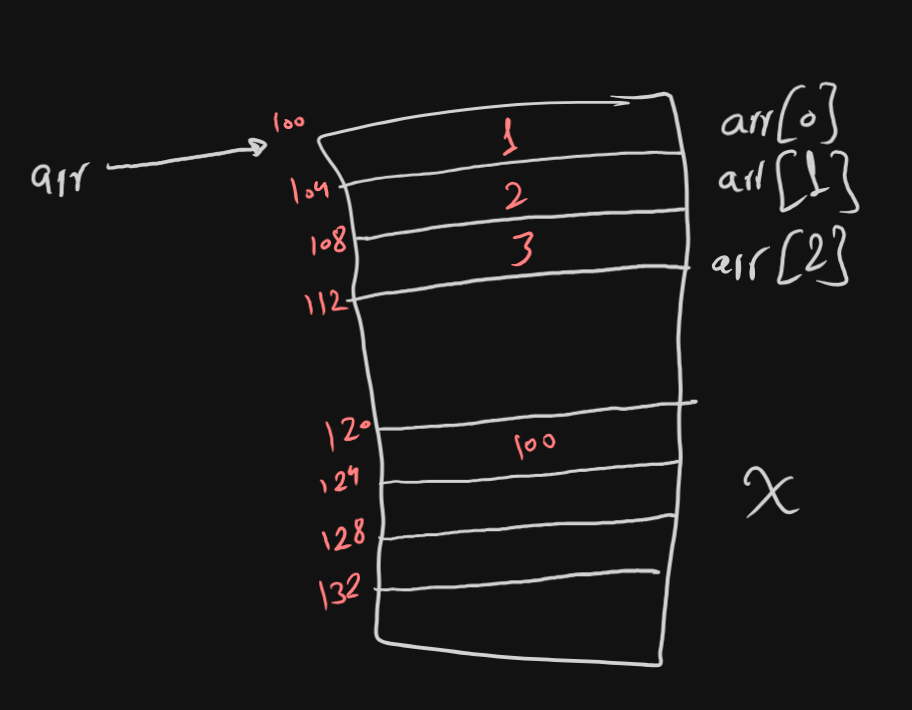

# What are Arrays?
An array is a collection of consecutive variables of the same datatype.
To define an array you type the `[datatype] [name of array][[number of vars]];`
like this:
`int arr[4];`
Array is a drift datatype like pointers. array is following the same memory management rules of storing variables, so if you define an array in `main()` function, its elements will be stored in the `stack`, if you made the array `static local` the elements will be stored in the `.bss` memory segment. 
The name of the array is the memory address of the first byte of the first element in the array, just like the function name.
The size of the array is the datatype of the array multiplied by the number of elements in it.
If you initialized the array with a non-zero value it will be stored in the `.data` memory segment.

Initializing arrays during declaration:
```c
int arr[4]={14,20,15,10}; // valid
int arr[]={14,20,15,10};  // valid
// Compiler counts how many elements and assigns the value according to that size
```
So, if this array was local or static local or static global it would be stored in the `.data` memory segment.
## What happens if you assign more elements?

```c
int arr[4] = {1,2,3,4,5};
```
In most IDEs, the program gives a syntax error but, in CodeBlocks it just gives a warning and neglects the extra element.
## What happens if you assign fewer elements?
```c
int arr[5] = {1,2,3};
```
The compiler zeroes the rest of the elements so it will be like this:
```c
int arr[5] = {1,2,3,0,0};
```
# Accessing Arrays
Arrays can be accessed by the same subscriptor operator we talked about earlier:
`arr[2];`, the number 2 is the index, the index of the number is the order of that number - 1 due to starting from zero.
```c
int arr[5] = {1,2,3,4,5};
printf("%i", arr[2]);
```
Output:
```
3
```

As we talked earlier, the name of the array is a pointer to the address of the first element, So we can access it using pointers' syntax:
```c
printf("%i", *(arr+2));
```
Notice here that if you are adding 2 on the array name, the step of it is the elements' datatype byte size, which means that in our case we are not sent to the third byte in the first element as the step is not only 1 byte, It will be pointing to the third element.
# Name of the array
The name of the array is a const pointer to the first element but it is not a total pointer as it is considered as an identifier. We can not describe it as a total real pointer as pointers have a physical place in the memory while the name of the array doesn't.

Example:
```c
int arr[3] = {1, 2, 3};

printf("%i\n", arr);
printf("%i\n", &arr);
```
Output:
```
-1325400620
-1325400620
```
You will notice here that both give the same value, but how is that?
#### But what is the difference between `arr` and `&arr`?
Same Value, Different Types:
- `arr` and `&arr` both give the **same memory address**
- But they have **completely different types**
```c
int arr[3] = {1, 2, 3};

// Both print the same address (let's say 100)
printf("%p\n", arr);    // 100 - pointer to first element  
printf("%p\n", &arr);   // 100 - pointer to entire array
```
##### Type Difference:
- `arr` (after decay) → **pointer to int** (`int*`)
- `&arr` → **pointer to array of 3 ints** (`int(*)[3]`)
Which means that they have different steps.
##### The Key Difference - Pointer Arithmetic:
```c
int arr[3] = {1, 2, 3};

printf("arr     = %p\n", arr);      // Let's say: 100
printf("arr + 1 = %p\n", arr + 1);  // 104 (moves by sizeof(int) = 4 bytes)

printf("&arr     = %p\n", &arr);      // 100
printf("&arr + 1 = %p\n", &arr + 1);  // 112 (moves by sizeof(entire array) = 12 bytes)
```
##### Visual Representation:
```
Memory:
Address: 100   104   108
Content: [1]   [2]   [3]   ← This is arr[3]

arr points to: 100 (points to first element)
arr + 1 = 104 (next element)

&arr points to: 100 (points to entire array block)  
&arr + 1 = 112 (next array-sized block)
```
##### Real-world analogy:
Think of an apartment building:
- `arr` is like the address of apartment #1
- `&arr` is like the address of the entire building
- Both might be "123 Main Street", but one refers to a single unit, the other to the whole building
The address is the same, but what you're pointing to (conceptually) is different!
### But what is a decay?
"Decay" in C refers to the automatic conversion of an **array** to a **pointer to its first element** in most contexts.
**What happens during decay:**
When you use an array name in most expressions, the compiler automatically converts it from "array of N elements" to "pointer to first element."
```C
int arr[3] = {1, 2, 3};
// arr has type "array of 3 ints"
// But when used in expressions, it "decays" to type "pointer to int"
```
#### When does decay happen?
- Passing arrays to functions
- Using array names in arithmetic expressions
- Assigning array names to pointers
- Most other contexts
#### When does not the decay happen? 
- `sizeof(arr)` - gives size of entire array
- `&arr` - gives address of entire array (not first element)
- Array initialization
# Least Index, Least Address
If you remember we demonstrated earlier that the stack gets inverted from debug mode to release mode, although it doesn't differ with arrays, arrays are treated from the compiler as a whole.
## Release mode
```c
int main() {
	int x,y, arr[3];
}
```
Reserving memory for variables in release mode is from up to down.
So, It is something like this:

## Debug mode
```c
int main() {
	int x,y arr[3];
}
```
Reserving variables inside stack here is reversed upside down except for the array.
So, It is something like this:

# Designated Initialization
Imagine that you want to declare an array of size 11 where all elements are zeroed except for fourth and fifth elements are of 1
You can type it like this:
```c
int arr[11]={[3]=1, [4]=1};
```
so it be like `0 0 0 1 1 0 0 0 0 0 0`

But, What if I didn't put a size for the array?
```c
int arr[]={[3]=1, [4]=1};
```
The size of the array now will be 5, it will look for the greatest designated initialization number.
# Determining the size of an array
```c
int arr[] = {1,2,3,4,5,6};
// If you need to determine the size of the array:

printf("%i", sizeof(arr)); 
// This is not valide as it will outptut 24, the number of bytes of all elements.

printf("%i", sizeof(arr)/sizeof(arr[0])); 
// This is 24 divided by 4 giving us 6
```
Output:
```
24
6
```
# Array of pointers
You can define an array of pointers, where each element can hold up an address for a certain datatype.
```c
int x=2,y=12;
int *ptrArr[2] = {&x,&y};
printf("%i\n", ptrArr[1]);
printf("%i\n", *ptrArr[1]); 
```
Output:
```
6356732
12
```
It has the same properties of a normal array and a normal pointer.

Do not forget that the name of the array is a pointer itself to the first byte of the first array, so we can say that this array is a pointer to pointers
```c
#include <stdio.h>

int main() {
    int x=2,y=12;
    int *ptrArr[2] = {&x,&y};
	
	printf("%i\n", &ptrArr[1]);          // Address of the second element 
    printf("%i\n\n", ptrArr+1);          // Address of the second element
    // This the address of the pointer holding the address of y
    
    printf("%i\n", ptrArr[1]);           // Address of y
    printf("%i\n\n", *(ptrArr+1));       // Address of y
	// Dereferencing the address of the array + 1 step
	
    printf("%i\n", *ptrArr[1]);          // Value of y
    printf("%i\n", **(ptrArr+1));        // Value of y
    // Dereferencing the address of the value hold by the second element 
}
```
Output:
```
6356724
6356724

6356728
6356728

12
12
```
# Array of pointers to function
The syntax is like that:
```c
int (*ptr[2]) (int, int);
```
This is an array holding to pointers, each one is pointing to a function that takes 2 integers and return an integer.
So, in every index I can assign it into a function name (address of the function) to it.
```c
#include <stdio.h>

int sum(int,int);
int product(int,int);

int main() {
	int (*ptr[2]) (int, int);
	ptr[0]=sum;
	ptr[1]=product;
	
	printf("The sum is \n");
	printf("%i\n", (*ptr)(5,3));         // using dereferencing
	printf("%i\n\n", ptr[0](5,3));       // using subscriptors
	
	printf("The product is \n");
	printf("%i\n", (*(ptr+1))(5,3));     // using dereferencing
	printf("%i\n", ptr[1](5,3));         // using subscriptors
}

int sum(int x, int y) {
	return x+y;
}

int product(int x, int y) {
	return x*y;
}
```
Output:
```
The sum is
8
8

The product is
15
15
```
# Pointer to Array
We need first to understand precedence, the subscriptor operators have the same precedence of the normal parenthesis, which means that they have higher precedence than unary operators like dereferencing operator.

So, if we typed:
```c
int *x[4];
```
The subscriptor operators (`[]`) has higher operator than dereferencing operator (`*`). So, We spell the subcriptor operator first - array - of a dereference of x - pointer - which means array of pointers.

But if we typed:
```c
int (*x)[4];
```
The subscriptor operators (`[]`) has the same precedence of the parenthesis (`()`), So, the compiler executes from the left to right, We spell the dereference operator - pointer - first, then we spell the subscriptor operators - array - which means a pointer to array.
## Initializing it with a value:
Lets say we have an integer array of size 4, we want to set a pointer to array to it.
How can we do that?
In CodeBlocks you can assign it to the array name, To remember, Array name will be decayed into a pointer to int pointing to the first element.
```c
int arr[4]={1,4,6,8};
int (*x)[4]=arr;
// شrr here is decayed into a pointer to int.
// So, you assigned the address of the first element to the array pointer.
```

But, In VScode as we know, we can not assign different pointer types, so we need to cast it:
```c
int arr[4]={1,4,6,8};

int (*x)[4]=(void*)arr;
// Casted using void keyword

int (*x)[4]=(int(*)[4])arr;
// Casted using specific type casting (pointer to integer array datatype )
```
Alternative way is to set it to the address of pointer name `&arr` as we talked earlier this is a pointer to array, so no need to cast anything.
```c
int arr[4]={1,4,6,8};

int (*x)[4]=&arr;
/* Assigning the value fo the pointer to array (address of the whole array) into the pointer to the array x */
```
## Pointer to Array Step
Okay, now what do you think the step of a pointer to array is?
The step of a pointer to array will be the size of array it is pointing to 
`[datatype bytes]*[numebr of elements`
```c
int (*x)[3];
// The size of the array is 12
// Then the step of the pointer is 12
```
## Dereferencing Pointer to array
This pointer is a special pointer, when you try to dereference it, it does not dereference normally:
```c
#include <stdio.h>

int main() {
    int arr[3]={1,2,3};
    int (*x)[3]=(void*)arr;
    // Let the address of the array be 100, and address of pointer x be 120


    printf("&x\t= %i\n\n", &x);     // 120
    // This is the address of the pointer to array x.


    printf("x\t= %i\n", x);         // 100
    // This is the value that pointer is holding

    
    printf("arr\t= %i\n", arr);     // 100
    // This is the name of the array decayed into a pointer to int.
    // It is no a pointer to int pointing to the first element.
    // It has the step of 4 bytes (integer pointer step).

    
    printf("&arr\t= %i\n", &arr);   // 100
    // This is the address of the whole array.
    // Casted into a pointer to the whole array.
    // It has the step of 12 bytes (whole array pointer step)
    
    
    printf("*x\t= %i\n\n", *x);     // 100
    // Dereferencing here just converts it.
    // Converted from a pointer to arry into a pointer to int.
    // It is still a pointer holding the address of first element.
    // So, It prints out the address of the first element.


    printf("**x\t= %i\n", **x);      // 1
    // Dereferencing the pointer to int holding the address of first element.


    return 0;
}
```
Output:
```
120

100
100
100
100

1
```

#### In our last example:
```c
printf("arr\t= %i\n", arr);     // arr decays to pointer to first element
printf("*x\t= %i\n", *x);       // *x gives array, which then decays to pointer
```
Both print the same address because:
1. `arr` decays from "array of 3 ints" → "pointer to int pointing to first element"
2. `*x` gives you the array, which immediately decays to "pointer to int pointing to first element"

Visual representation:
```c
int arr[3] = {1, 2, 3};

// Without decay: arr represents the entire array [1][2][3]
// With decay: arr becomes a pointer → pointing to address of arr[0]
```
## Summary
Imagine the pointer to array as a pointer to pointer to the first element of the an array.
As the name of the array is decayed into a pointer to `arr[0]`. And the pointer to array is assigned to it.

### Another Example
```c
#include <stdio.h>
int main() {
	int arr[4]={1,4,6,8};
	int(*ptr)[4]=&arr;
	// Let the address of the array be 100, and address of pointer ptr be 200
	
	printf("%i\n",ptr);                  // 100
	// Value of ptr
	
	printf("%i\n\n",*ptr);                 // 100
	// Converted from a pointer to arry into a pointer to int.
	// It is still a pointer holding the address of first element.
	
	printf("%i\n\n",*ptr+1);               // 104
	// (*) has higher precedence than (+).
	// It is converted into pointer to int first and added one step (4 bytes). 
	
	printf("%i\n",ptr+1);                // 116
	// Adding one step (16) to a pointer to array.
	
	printf("%i\n\n",*(ptr+1));             // 116
	// First: Adding one step (16) to a pointer to array
	// Then converting the pointer to array into a pointer to int
	
	printf("%i\n",**ptr);                // 1
	// First (*) converts pointer to array into a pointer to int
	// Second one dereferences the value it is holding 
	
	printf("%i\n",*((*ptr)+1));          // 4
	// First: Converting pointer to array into a pointer to int
	// Second: Adding one step to the int pointer (100+4)
	// Third: Dereferencing the pointer
	
	return 0;
}
```
Output:
```
100
100

104

116
116

1
4
```
# Passing arrays to functions
Imagine that we want to make a function that prints the array:
```c 
#include <stdio.h>

void printArr(int*,const int *);

int main() {
	int arr[3] = {1,2,3};
	const int arrSize = sizeof(arr)/sizeof(*arr);
	printArr(arr,&arrSize);
}

void printArr(int* p,const int *size) {
	for(int i=0; i<*size; i++)
		printf("Element %i = %i\n", i, *(p+i));
}
// you can also type it like this:
// void printArr(int p[],const int *size)
```
You will notice here it is the same as passing variable with reference. You can pass the name of the array as a pointer to the first element.
# Size of array
The size of the arrays as variables should be constant value, But only when the array is defined globally.
```c
#include <stdio.h>

int y=3;
int arr_1[y];

int main() {
    int arr_2[y];
    static int arr_3[y];

    return 0;
}
```
In this code, Only `arr_2` will be defined safely as the  `arr_2` is a local array that is defined during runtime, So, there is no harm in it.
But `arr_1` and `arr_3` are global and static local resp. which are defined before runtime, So, it must be constant value.

**Some other compilers may refuse all of them.**

So By convention, We define the size of the array as a macro.
```c
#define arrSize 19
int arr[arrSize];
```
# Two Dimensional Array
