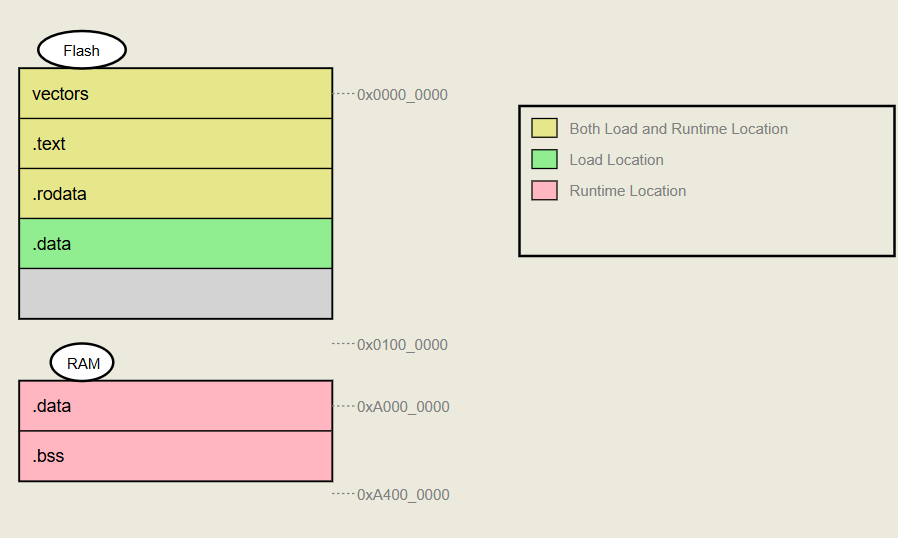
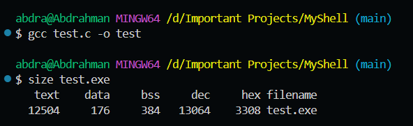

#static #extern #variableTypes #memorySegments
# Understanding Variable Types
Variables in C/C++ differ across four fundamental characteristics:
- **Scope** - Where the variable can be accessed
- **Initial Value** - What value the variable starts with
- **Memory Segment** - Which part of memory stores the variable
- **Lifetime** - How long the variable exists
# Scope Resolution
**Scope resolution** is the process by which a programming language determines which variable, function, or class member to use when multiple definitions share the same name across different scopes (local, global, class, namespace, etc.).
### C++ Scope Resolution Example:
```cpp
#include <iostream>
using namespace std;

int x = 100;  // Global variable

int main() {
    int x = 50;               // Local variable
    cout << x << endl;        // Prints 50 (local x)
    cout << ::x << endl;      // Prints 100 (global x using scope resolution operator)
}
```

```cpp
class A {
public:
    static int value;
};
int A::value = 10;  // Define the static member variable
```
### Static vs Dynamic Scoping

| Feature          | Static Scoping (Lexical)          | Dynamic Scoping                    |
| ---------------- | --------------------------------- | ---------------------------------- |
| **When decided** | Compile time                      | Runtime                            |
| **How resolved** | Based on **code structure**       | Based on **call stack**            |
| **Common in**    | C, C++, Java, Python, JavaScript  | Lisp (early), Perl, Bash (partial) |
| **Efficiency**   | Faster (resolved at compile time) | Slower (runtime lookup required)   |
| **Behavior**     | Always consistent                 | Depends on calling context         |

#### Static Scoping (Lexical Scoping)
In static scoping, variable resolution follows the lexical structure of the code. The compiler searches for variables in the containing block or function first, then in outer scopes, and finally in global scope. This approach looks at **where the variable is defined in the source code**, not where the function is called. Static scoping is used by **C, C++, Java, Python, and JavaScript**.
#### Dynamic Scoping
In dynamic scoping, variable resolution follows the execution call stack. The program searches for variables in the current function, then in the calling function, and continues up the call chain. This approach looks for the most recent variable definition in the **function call sequence**, not in the lexical code structure. **C and C++ do not support dynamic scoping**. Some older languages like **LISP and early BASIC** supported it.
### Example: Static vs Dynamic Scoping
```c
#include <stdio.h>

int x = 0;  // Global variable

int f() {
    return x;
}

int g() {
    int x = 1;  // Local variable
    return f();
}

int main() {
    printf("%d\n", g());
    return 0;
}
```
This prints `0` because C uses static scoping. With dynamic scoping, it would print `1`.
# The extern Keyword
The `extern` keyword extends a variable's scope from file scope to project scope, allowing access across multiple source files.
Consider two files in the same project:
**file1.c:**
```c
#include <stdio.h>

int x = 5;  // Global variable with file scope

int main() {
    return 0;
}
```

**file2.c:**
```c
#include <stdio.h>

extern int x;  // Declares x as externally defined

int main() {
    printf("%d\n", x);  // Can now access x from file1.c
    return 0;
}
```

**Important:** You cannot initialize a variable when declaring it with `extern`. The linker handles the connection between files during compilation.

# Local Variables
### Characteristics:
- **Scope:** Block scope (within curly braces)
- **Initial Value:** Garbage value (undefined)
- **Memory Segment:** Stack
- **Lifetime:** Function execution duration
### Examples of Local Variable Scope:
**Function scope:**
```c
#include <stdio.h>

int main() {
    int x;  // Local to main function
    return 0;
}
```

**Block scope:**
```c
#include <stdio.h>

int main() {
    {
        int x;  // Local to this block
    }
    return 0;
}
```

**Parameter scope:**
```c
#include <stdio.h>

void fun(int x) {  // x is local to function fun
    return;
}

int main() {
    return 0;
}
```
# Global Variables
### Characteristics:
- **Scope:** File scope
- **Initial Value:** Default value for the data type (0 for integers, NULL for pointers)
- **Memory Segment:** `.bss` (if uninitialized or initialized to default value) or `.data` (if initialized to non-default value)
- **Lifetime:** Program execution duration
## Local vs Global: Practical Examples
### Example 1: Variable Shadowing
```c
#include <stdio.h>

int x = 5;  // Global variable

int main() {
    int x = 10;  // Local variable shadows global
    printf("%i\n", x);  // Prints 10
    return 0;
}
```
The local variable takes precedence due to smaller scope.
### Example 2: Function Access
```c
#include <stdio.h>

int x = 5;  // Global variable
void f(void);

int main() {
    int x = 10;  // Local variable
    printf("%i\n", x);  // Prints 10
    f();                 // Prints 5
    return 0;
}

void f(void) {
    printf("%i\n", x);  // Accesses global x (no local x in scope)
}
```
### Example 3: Block Modification
```c
#include <stdio.h>

int x = 5;  // Global variable

int main() {
    int x = 10;  // Local variable
    {
        x = 20;      // Modifies the local variable
        printf("%i\n", x);  // Prints 20
    }
    printf("%i\n", x);      // Prints 20
    return 0;
}
```
### Example 4: Nested Block Variables
```c
#include <stdio.h>

int x = 5;  // Global variable

int main() {
    int x = 10;  // Local variable
    {
        int x;       // New local variable in inner scope
        x = 20;
        printf("%i\n", x);  // Prints 20
    }
    printf("%i\n", x);      // Prints 10 (outer local variable)
    return 0;
}
```
### Example 5: Self-Assignment Issue
```c
#include <stdio.h>

int x;  // Global variable (initialized to 0)

int main() {
    int x = x;  // Local variable assigned to itself (garbage value)
    printf("%i\n", x);  // Prints garbage value
    return 0;
}
```

In C++, you can use the scope resolution operator to access the global variable:
```cpp
#include <iostream>

int x;  // Global variable

int main() {
    int x = ::x;  // Local variable assigned global variable's value
    std::cout << x << std::endl;  // Prints 0
    return 0;
}
```
# Static Variables
### Static Global Variables
- **Scope:** File scope (cannot be accessed from other files)
- **Initial Value:** Default value for the data type
- **Memory Segment:** `.bss` or `.data` (same as regular global variables)
- **Lifetime:** Program execution duration

Static global variables are identical to regular global variables except they cannot be accessed using `extern` from other files.
### Static Local Variables
- **Scope:** Block scope (where declared)
- **Initial Value:** Default value (0 for integers)
- **Memory Segment:** `.bss` or `.data`
- **Lifetime:** Program execution duration

Static local variables are initialized only once before runtime, so we can say that all variable types are initialized before runtime except for normal local variables which are initialized during runtime.
### Static Variable Examples

#### Example 1: Regular vs Static Local
```c
#include <stdio.h>

void print(void);

int main() {
    print();  // Prints 0
    print();  // Prints 0
    print();  // Prints 0
    return 0;
}

void print(void) {
    int x = 0;       // Regular local variable
    printf("x=%i\n", x);
    x++;
}
```

```c
#include <stdio.h>

void print(void);

int main() {
    print();  // Prints 0
    print();  // Prints 1
    print();  // Prints 2
    return 0;
}

void print(void) {
    static int x = 0;  // Static local variable
    printf("x=%i\n", x);
    x++;
}
```
#### Example 2: Initialization Restrictions
This code causes a compilation error:
```c
#include <stdio.h>

int print2(void);
void print(void);

int main() {
    print();
    return 0;
}

void print(void) {
    static int x = print2();  // ERROR: Cannot initialize static with function call
    printf("x=%i\n", x);
}

int print2(void) {
    printf("not ok\n");
    return 5;
}
```

Static variables must be initialized with compile-time constants only.
## Key Insight: Static Keyword Effects
**Does the `static` keyword affect scope or lifetime?**
- For **global variables:** Affects scope (limits to file scope)
- For **local variables:** Affects lifetime (extends to program lifetime)
## Static Functions
By default, functions have software scope and can be used across files. The `static` keyword limits function scope to the current file.
**Example: Regular function (accessible across files):**

**file1.c:**
```c
void hello(void) {
    printf("hello");
}
```

**file2.c:**
```c
#include <stdio.h>

void hello(void);  // Function declaration

int main() {
    hello();  // Works fine
    return 0;
}
```

**Example: Static function (file scope only):**

**file1.c:**
```c
static void hello(void) {
    printf("hello");
}
```

**file2.c:**
```c
#include <stdio.h>

static void hello(void);  // Declaration

int main() {
    hello();  // Linker error - function not accessible
    return 0;
}
```
# Const Variables
### Const Local Variables
- Have the same properties as regular local variables
- Cannot be modified after initialization
- Can be changed indirectly using pointers (undefined behavior)
### Const Global Variables
- Have the same properties as regular global variables except:
- Cannot be modified after initialization
- Stored in `.rodata` (read-only data) segment instead of `.data` in initialized non zero values, and stored in `.bss` in initialized zero values, or uninitialized.
- Attempting to modify results in runtime error
# Memory Segments

### RAM Segments:

#### Stack
- Stores function contexts (things function stores before calling another function) and local variables
- Grows and shrinks during program execution
- Fast access but limited size

#### Heap
- Used for dynamic memory allocation at runtime
- Grows and shrinks based on memory requests
- Managed by `malloc()`, `free()`, etc.

#### .bss (Block Started by Symbol)
- Stores uninitialized global and static variables
- Variables automatically initialized to zero
- Consumes no space in the executable file

#### .data
- Stores initialized global and static variables with non-zero values
- Takes up space in the executable file

### Flash Memory Segments:

#### .rodata (Read-Only Data)
- Stores string literals, const global variables, and lookup tables
- Read-only during program execution
- Located in non-volatile memory

#### Interrupt Vector Table (IVT)
- Contains addresses of interrupt handler functions
- Each interrupt type has a corresponding entry
- Read-only, located in flash memory

#### .text
	- Contains compiled program instructions (machine code) (exe)
- All executable code resides here
- Read-only, located in flash memory

### Dual Location: .data Segment

The `.data` segment exists in both Flash and RAM:

1. **Flash Memory:** Contains initial values of initialized global/static variables
2. **RAM:** Working copy created at program startup

**Startup Process:**
1. Program loads into Flash memory
2. Startup code (in `.text`) executes first
3. Startup code copies initialized data from Flash `.data` to RAM `.data`
4. Startup code zeros out the `.bss` segment in RAM
5. Program execution begins



| Segment       | Content                          | Flash Location | RAM Location | Writable? | Notes                                    |
| ------------- | -------------------------------- | -------------- | ------------ | --------- | ---------------------------------------- |
| `.text`       | Machine code instructions        | Yes            | No           | No        | Executes directly from Flash            |
| `.rodata`     | Constants, string literals       | Yes            | No           | No        | Read-only data in Flash                  |
| `.data`       | Initialized globals/statics      | Yes (initial)  | Yes (runtime)| Yes       | Copied from Flash to RAM at startup     |
| `.bss`        | Uninitialized globals/statics    | No             | Yes (zeroed) | Yes       | Zero-initialized in RAM                  |
| Heap          | Dynamic memory                   | No             | Yes          | Yes       | Grows upward in RAM                      |
| Stack         | Local vars, return addresses     | No             | Yes          | Yes       | Grows downward in RAM                    |
| IVT           | Interrupt vectors                | Yes (fixed)    | No           | No        | Contains stack pointer and ISR addresses |
# Checking Code Size

You can view your program's memory usage in two ways:

**Method 1: Command line**


**Method 2: Check the `.lss` file in your project directory**

# Storage Class Keywords

## `auto` Keyword
- Used for declaring local variables (optional)
- Has no functional effect in modern C
- Cannot be used with global variables

```c
#include <stdio.h>

int main() {
    auto int x = 10;  // Explicitly shows it's a local variable
    return 0;
}
```

Invalid usage:
```c
#include <stdio.h>

auto int x = 10;  // ERROR: auto cannot be used for global variables

int main() {
    return 0;
}
```

Some people use it without using the datatype, but this is not preferred, as the compiler implicitly converts it to the nearest type for it.
```c
#inlcude <stdio.h>

int main () {
	auto x = 10; // Casted into int
	printf("%i", x);
	return 0;
}
```
## `register` Keyword
- **Suggests** to the compiler that a variable should be stored in CPU registers
- Compiler may ignore this suggestion
- **Restriction:** Cannot use the address operator (`&`) on register variables
- Modern compilers typically handle register allocation better than manual specification

## `volatile` Keyword
- Tells the compiler that a variable's value may change unexpectedly
- Prevents compiler optimization that might cache the variable's value
- Essential for hardware registers, interrupt handlers, and multi-threaded code
- `volatile` and `const` are called **type qualifiers**
## Storage Class Summary

| Storage Class | Memory Location     | Initial Value | Scope                          | Lifetime     |
| ------------- | ------------------- | ------------- | ------------------------------ | ------------ |
| **auto**      | Stack               | Garbage       | Block scope                    | End of block |
| **extern**    | .data or .bss       | Zero          | Global (multiple files)        | Program end  |
| **static**    | .data or .bss       | Zero          | Block (local) or File (global) | Program end  |
| **register**  | CPU registers/Stack | Garbage       | Block scope                    | End of block |
