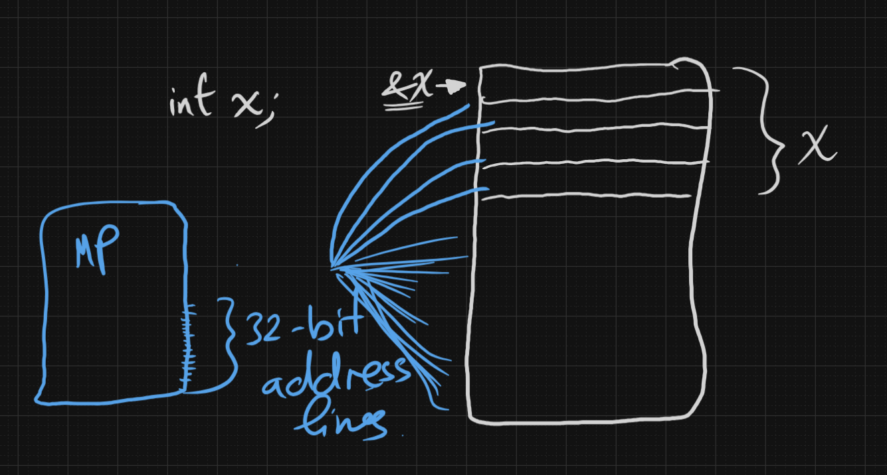
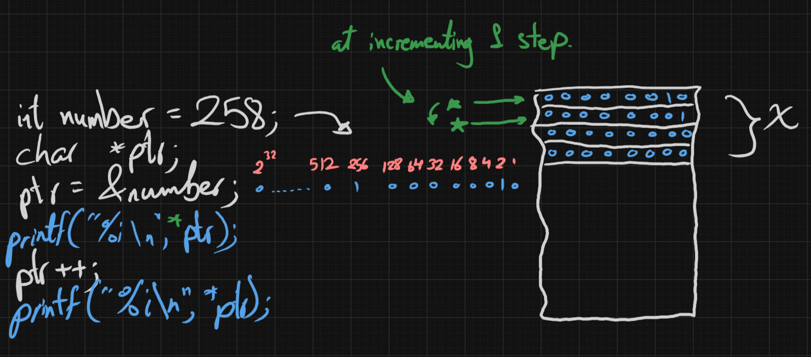

#pointers
# Pointers:
Pointers are drift datatype, they are variables that are able to store the address of other variables. It takes the same datatype of the variable storing its address.
The size of pointers is determined by the number of address lines on the micro-controller or the processor. 
The Address lines of normal processors are 16-bit, 32-bit or 64-bit according to the archi of the system and the compiler. But in this article we will continue with 32-bit.
If we declare a variable x of integer datatype, it will take 4 bytes in the memory, each byte having 32 bits. If we tried to access the address of the x variable we will only access the address of the first byte.

To declare a pointer we follow this:
`[Datatype_of_variable_to_be_pointed]* [pointer_name]`, so it be like this:
`int* ptr;`
If we declared a char pointer and integer pointer, you will notice that the size of both is constant **4 bytes in our case.**
```c
#include <stdio.h>

int main(void) {
	int* int_ptr;
	char* char_ptr;
	
	printf("%i\n", sizeof(int_ptr));
	printf("%i", sizeof(char_ptr));
}
```
Output on 32-bit system:
```
4
4
```
Output on 64-bit system:
```
8
8
```
**Why is that?**
The pointers hold the address of the first byte of the variable assigned to them, so it must hold 32 bits (4 bytes) on 32-bit system, or 64 bits (8 bytes) on 64-bit system, or 16 bits (2 bytes) on atmega32.
Note: The pointers are variables, so they also have addresses.
## Assigning Addresses:
We can assign addresses inside pointer through two ways:
```c
// Way 1
int* ptr_1 = &x;

// Way 2
int* ptr_2;
ptr_2 = &x; // can not have astrisk here
```
Notice that:
```c
char* y,z;
// here only y is a pointer, while z is a normal char variable. 

char* y,*z;
// here both are pointers.
```
Best Practice it to stick the asterisk to the pointer's name.
## Accessing Pointers:
We can access the pointer through its dereference operator.
```c
int x = 50;
int *ptr = &x;
*ptr = 120;
```
As the pointer is the same datatype of the variable pointed to, it will access the first byte and continues the rest 3 bytes.

What if the pointer was not the same datatype of the variable?
```c
int x = 50;
short *ptr = &x;
*ptr = 120;
```
What happens here is that the pointer is accessing only the first two bytes of the x variable, which makes a lot of troubles. So this gives a compilation error.
```
error: incompatible pointer type 
```

The Asterisk has 3 names during the accessing:
- Dereference operator: As it cancels out the referencing.
- Value of operator: As it gives out the value of what is the pointer is holding
- Indirection operator: As we access the variables indirectly through it
The dereference asterisk is considered a unary operator.
## Pointers step:
Each pointer has a step of n bytes. If the pointer is int then it's step is 4 bytes, if it is char then its one byte.
So, When we increment a pointer we are incrementing it by a step.
```c
int x = 50;
int *p = &x;
p++; // Now the pointer is shifted 4 bytes.
```
# Pointers Casting
Pointer casting is the process of converting a pointer from one type to another. It's a powerful but potentially dangerous feature that requires careful handling.
### Implicit Casting (Automatic):
```c
void* generic_ptr;
int* int_ptr;
generic_ptr = int_ptr;  // Implicit cast to void* - always safe
```
### Explicit Casting (Manual):
```c
void* generic_ptr;
int* int_ptr = (int*)generic_ptr;  // Explicit cast from void*
```

If you try to deal with a short pointer to an int value, you will notice that the compiler will give you a warning, or even in some compilers like in VScode it refuses and gives an error. In Cpp it also refuses on most compilers.
```c
int x=1090;
short *p=&x;
```
Output on VScode:
```
error: initialization of 'short int *' from incompatible pointer type 'int *'
```
What happens here is that it deals with `&x` as an integer pointer value, so it needs to be casted into short:
```c
int x=1090;
short *p=(short*)&x
```
This works well, telling the compiler that I know what I am doing, it is not by accident.
# Some Examples on pointers:
## Example 1:
If you see this code snippet:
```c
#include <stdio.h>

int main() {
	int number=258;
	char *ptr=&number;
	printf("%i\n", *ptr++); // 2
	printf("%i\n", *ptr);   // 1
}
```
What happens is that the ptr is of 1 byte size, so it points to the first byte of the 4 bytes of number which is `0000 0010` then it is incremented by one step (1 byte) which means that it will point to the next byte which is `0000 0001`.

## Example 2:
If you look at this code snippet:
```c
#include <stdio.h>

int main() {
    int x = 258;
    int *ptr1 = &x;
    char *ptr2 = &x;
    printf("%i\n", *ptr1); // -> 258
    printf("%i\n", *ptr2); // -> 2
    *ptr2 = 4;
    printf("%i\n", *ptr1); // -> 260
    printf("%i\n", *ptr2); // -> 4
    return 0;
}
```
You will notice that the `*ptr2=4;`statement changes the whole byte of the variable x. Which also overwrites the value of the first byte from `0000 0010` into `0000 0100`.

## Alternative way on Modern IDEs:
Those 2 Examples work fine on codeblocks as it uses an older version of gcc while VScode and modern IDEs use more strict compilers that won't compile this code.
In nowadays compilers do not support assigning non-convenient pointer types, but we can achieve that by an alternative way.
This alternative way is explicit casting of the pointers:
instead of `char *ptr2 = &x;` we can type this `int *ptr2 = (char*)&x;`
Full code:
```c
#include <stdio.h>

int main() {
    int x = 258;
    int *ptr1 = &x;
    char *ptr2 = (char*)&x;
    printf("%i\n", *ptr1); // -> 258
    printf("%i\n", *ptr2); // -> 2
    *ptr2 = 4;
    printf("%i\n", *ptr1); // -> 260
    printf("%i\n", *ptr2); // -> 4
    return 0;
}
```
## Example 3:
If you notice this code:
```c
#include <stdio.h>

int main() {
    int x;
    int *ptr;
    printf("%i\n", &x);
    printf("%i\n", &ptr);
    return 0;
}
```
Output:
```
6356728
6356732
```
You will notice that they are after each other as they are ordered in the stack.
## Example 4:
Using fake pointers, you can use fake pointers but they will have some incompatibility problems:
```c
#include <stdio.h>

int main() {
    int x;
    int *realPTR=&x;
    int fakePTR=(int)&x;
    printf("%llx\n", &x); 
    printf("%llx\n", realPTR);
    printf("%llx\n", fakePTR);
    return 0;
}
```
Output:
```
f3d63ff8b0
f3d63ff8b0
d63ff8b0
```
We are using `"%llx"` as pointers are preferred with addresses or `"%p"`. The `"%llx"` expects a 64-bit address "unsigned long long" and the `"%p"` suits the pointer address according to the system. 
While using `"%x"` expects a 32-bit address "unsigned int" which makes it truncates the address.
```c
#include <stdio.h>

int main() {
    int x;
    int *realPTR=&x;
    int fakePTR=(int)&x;
    printf("%x\n", &x); 
    printf("%x\n", realPTR);
    printf("%x\n", fakePTR);
    return 0;
}
```
Output:
```
32bffbe0  // truncated (not the full address)
32bffbe0  // truncated (not the full address)
32bffbe0  // full address
```
## Example 5:
When you subtract one pointer from another, the compiler first subtracts their memory addresses, then divides the result by the size of the data type they point to. This way, the result represents how many elements (or steps) apart the two pointers are.
```c
#include <stdio.h>

int main() {
    int *p1 = (void*) 100, *p2 = (void*) 200;
    int steps = p2-p1;
    printf("%i\n", steps);
    return 0;
}
```
Output:
```
25 
// 200-100/4
```
`(void*)` is a **type cast** in C and C++ that converts a value or pointer to a "void pointer" type.
If you try to add them it will give you a syntax error, as adding has no meaning.
```c
int steps = p2+p1; // syntax error
```
## Example 6:
Make sure that your pointer matches what it is pointing to.
```c
#include <stdio.h>

int main () {
	unsigned short x = 65535;
	short *p = &x;
	
	if(65535==*p)
		printf("They are Equal\n");
	else
		printf("They are different\n");
}
```
Output:
```
They are different
```
As you can see here the x is unsigned short while the pointer is signed so, when comparing the pointer is of a value of `11111111 11111111` which is considered `-1` in signed short type.
But if we casted it into unsigned short:
```c
#include <stdio.h>

int main () {
  unsigned short x = 65535;
  short *p = &x;
  if(65535==(unsigned short)*p)
    printf("They are Equal\n");
  else
    printf("They are different\n");
}
```
Output:
```
They are Equal
```
## Example 7:
```c
#include <stdio.h>

int main () {
    unsigned int  var = 20;
    unsigned int  *ip;
    ip = &var;
    
    printf("%p\n", &var);
    printf("%p\n\n", ip);
    printf("%u\n", *&var);
    printf("%u\n", *ip );
    
    return 0;
}
```
Output:
```
00000080eabffa44
00000080eabffa44

20
20
```
As the compiler translates the `&var` to an `unsigned int *p` carrying the address of the var, it translates into dereferencing a pointer.
`*&var` = `*(unsigned int pointer carrying the address of var)`.

# Subscriptor Operator
Imagine that you have a 4-byte integer and you try to access the bytes number 3 and 4 (second 2 bytes) in it through a short pointer.
```c
#include <stdio.h>

int main() {
    int x=65538;
    short *p=(short*)&x;
    printf("%i\n",*(p+1)); // Accesses second two bytes
    printf("%i\n",*p);     // Accesses first two bytes
    return 0;
}
```
Another approach for doing that is by the subscriptor operator:
```c
#include <stdio.h>

int main() {
    int x=65538;
    short *p=(short*)&x;
    printf("%i\n",p[1];      // Equivalent to *(p+1)
    printf("%i\n",p[0]);     // Equivalent to *p
    return 0;
}
```

# Incrementing Pointers
## Example 1:
```c
#include <stdio.h> 
#include <stdlib.h> 
int main() { 
	int x=50, y; 
	int* ptr=&x; 
	printf("%i\n", ptr); 
	y=*ptr++; 
	printf("%i\n", x); 
	printf("%i\n", y); 
	printf("%i\n", ptr); 
	return 0; 
}
```
Output:
```
1545599536
50
50
1545599540
```
You will notice here that the incrementing operator `++` has a higher precedence than the dereference operator `*`.
So, first it post increments the `ptr` then it dereferences it.
## Example 2:
```c
#include <stdio.h> 
#include <stdlib.h> 
int main() { 
	int x=50, y; 
	int* ptr=&x; 
	printf("%i\n", ptr); 
	y=(*ptr)++; 
	printf("%i\n", x); 
	printf("%i\n", y); 
	printf("%i\n", ptr); 
	return 0; 
}
```
Output:
```
1545599536
51
50
1545599540
```
The braces here have a higher precedence than the incrementing operator, which means that the braces first executes (dereferencing) then the rest of the line (incrementing).
# Pointers with constants
If you can see this code
```c
#include <stdio.h>

int main() {
    const int x=5;
    int *ptr=(int*)&x;
    *ptr=20;
    printf("%i\n", x);
}
```
Output:
```
20
```
We can modify the const values in C using pointers, but how is that?
The const local variables are stored in the stack, so we can access them by working around the compiler and changing them through pointers.
****
But if we have a const global variable that is initialized with a non zero value and we are trying to access it through pointers, That is not valid even though it will compile normally.
```c
#include <stdio.h>

const int y=12;

int main() {
    int *p2=(int*)&y;
    *p2=20;
    printf("%i\n", y);
}
```
This happens due to trying to access the `.rodata` memory segment which is read only. Trying to read inside the `.rodata` will crash the problem causing a runtime error.
```cpp
#include <iostream>

int main () {
    const int x = 5;
    int *p=(int*)&x;
    *p=20;
    std::cout << x << std::endl;
    std::cout << ++*p << std::endl;
}
```
****
But if you try to do this with a const global uninitialized or initialized with zero, The const global variable will be stored in the `.bss` segment which means that we can write in it.
So, in some compilers you will see this code works fine:
```c
#include <stdio.h>

const int x;
int main()
{
    int* ptr=(int*)&x;
    printf("ok\n");
    *ptr=100;
    printf("not ok\n");
    printf("x=%i\n",x);
    return 0;
}
```
Output on Codeblocks:
```
ok
not ok
x=100
```
****
This C++ code demonstrates undefined behavior! Here's what it's doing:
1. **`const int x = 5;`** - Declares a constant integer with value 5
2. **`int *p = (int*)&x;`** - Creates a non-const pointer to the const variable (using a C-style cast to override the const qualifier)
3. **`*p = 20;`** - Attempts to modify the const variable through the pointer
4. **Prints both `x` and `*p`**
**Important notes:**
- This code exhibits **undefined behavior** because you're modifying a `const` variable
- The compiler might optimize based on the assumption that `x` never changes
- Results are unpredictable - `x` might still show 5 while `*p` shows 20, or both might show 20, or anything could happen
- Different compilers and optimization levels will produce different results
```cpp
#include <iostream>

int main () {
    const int x = 5;
    int *p=(int*)&x;
    *p=20;
    std::cout << x << std::endl;
    std::cout << ++*p << std::endl;
}
```
# Wild Pointers
They are uninitialized or dangling pointers are pointers that point to arbitrary memory locations. They're one of the most dangerous types of bugs because they can cause unpredictable program behavior.
**Uninitialized pointers**:
Pointers declared but not assigned a valid memory address. They contain whatever garbage value was in that memory location.
```c
int *ptr;  // Wild pointer - contains random memory address
*ptr = 5;  // Undefined behavior - writing to unknown memory
```
**Dangling pointers**: 
Pointers that once pointed to valid memory, but that memory has been freed or deallocated.
```c
int *ptr = malloc(sizeof(int));
free(ptr);
*ptr = 5;  // Wild pointer - accessing freed memory
```
**Out-of-scope pointers**: 
Pointers to local variables that have gone out of scope.
```c
int* getPointer() {
    int x = 10;
    return &x;  // Returns pointer to local variable
}
// The returned pointer becomes wild when x goes out of scope
```

Trying to access (writing/reading) wild pointers will result in runtime error named as *segmentation fault*, As the pointer can be pointing to a value that is incompatible with the pointer datatype. 
So, in some compilers you can't assign an address manually to a pointer as you don't know that address is as the same datatype as your pointer or not.
****
***Segmentation Fault*:**
It is a runtime error occurs when you encounter to write or read an illegal memory location.
****
# Null Pointers
## Null character:
Null is the first character found in ASCI table, representing it in double quotes is `'\0'`, its binary is `0000 0000` representing `0`.
If you tried to print null character it will print nothing:
```c
#inlude <stdio.h>

int main() {
	printf("OK");
	printf("%i", '\0');
	printf("OK");
}
```
Output:
```
OKOK
```
It is used to indicate the end of a specific string.
## Null pointer:
It is a pointer that is pointing to NULL. You can not dereference it. Dereferencing it results in runtime error.
### Declaring a Null pointer has too many ways in C:
#### 1. Using NULL macro (most common)
```c
int *ptr = NULL;
char *str = NULL;
void *generic = NULL;
```
#### 2. Using literal 0
```c
int *ptr = 0;
char *str = 0;
void *generic = 0;
```
#### 3. Using (void*)0 cast
```c
int *ptr = (void*)0;
char *str = (void*)0;
```
#### 4. Using typed cast with 0
```c
int *ptr = (int*)0;
char *str = (char*)0;
```
#### 5. Implicit initialization to zero
```c
// Global and static variables are automatically initialized to 0/NULL
static int *global_ptr;   // Automatically NULL
int *static_ptr;          // If declared at file scope, automatically NULL

// In functions with explicit zero initialization
int *ptr = {0};           // Less common syntax
```
#### 6. Using \0 character (technically works but unusual)
```c
int *ptr = '\0';       // Works because '\0' is 0, but not recommended
```
#### 7. Using nullptr
```c
int *ptr = nullptr;
```
### Why null pointers?
A good practice is to use safety null pointer check.
Safety null pointer check is when we are declaring a non-initialized pointer to be used after a while, we set it to null, and every time we are accessing this pointer (read/write) we check if that pointer is not equal to null.
```c
#include <stdio.h>

int main() {
	int *p=NULL;
	if(p!=NULL) {
		printf("%i", p);
	} else
        printf("The Pointer is NULL\n");
}
```
This demonstrates the safety null pointer check principle: always verify a pointer is not NULL before attempting to dereference it.
So, I can avoid segmentation fault.
# Call by reference
Look at this code:
```c
#include <stdio.h>

void swap(int num1, int num2);

int main() {
	int x=7, y=2;
	swap(x,y);
	printf("%i\n", x);
	printf("%i\n", y);
}

void swap(int num1, int num2) {
	int temp=y;
	x=y;
	y=temp;
}
```
Output:
```
7
2
```
This is because the function is called by value, which means that the function makes another variables that have a function scope only. So, after returning the function swapped only `num1`and `num2` variables, not the actual `x`and `y` .

To solve this problem we deal with the calling by reference:
```c
#include <stdio.h>

void swap(int *num1, int *num2);

int main() {
	int x=7, y=2;
    swap(&x,&y);          // passing the address as a pointer.
	printf("%i\n", x);
	printf("%i\n", y);
}

void swap(int *num1, int *num2) {    // recieving the vars as pointers.
	int temp=*num1;
	*num1=*num2;
	*num2=temp;
}
```
Output:
```
2
7
```
****
 So, the `printf("%i", x);` function takes a copy from the variable as I only read it, I do not want to change anything in it.
 While, the `scanf("%i", y);` function modifies the variable (the memory address) itself as it overwrites that memory address.
 #  