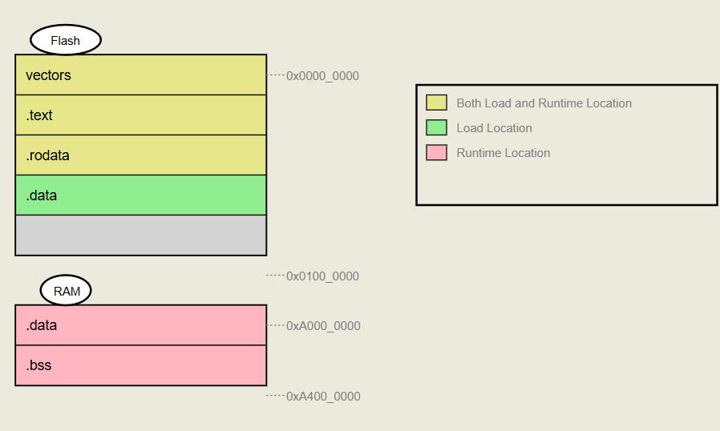
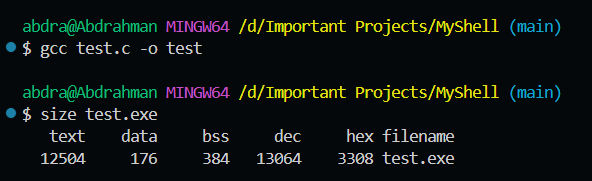

#static #extern #variableTypes #memorySegments
# **Note 1: " Global VS Local Variables types "**
Variables have many types that differs in 4 main points:
- Scope
- Initial Value
- Memory segment
- Lifetime

### Scope Resolving:
The scope resolving is (or **scope resolution**) is the process by which a programming language determines **which variable, function, or class member to use** when there are multiple definitions with the same name in different scopes (local, global, class, namespace, etc.).
##### In C++:
```cpp
#include <iostream>
using namespace std;

int x = 100;

int main() {
    int x = 50; 
    cout << x << endl;    // Prints 50 (local x)
    cout << ::x << endl;  // Prints 100 (global x, resolved using ::)
}
```

```cpp
class A {
public:
    static int value;
};
int A::value = 10; // The variable value that belongs to the namespace A
```

#### Static Scoping VS Dynamic Scoping:
| Feature              | Static Scoping (Lexical)      | Dynamic Scoping                   |
| -------------------- | ----------------------------- | --------------------------------- |
| **When decided**     | Compile time                  | Runtime                           |
| **How resolved**     | Based on **code structure**   | Based on **call stack**           |
| **Common in**        | C, C++, Java, Python, JS      | Lisp (early), Perl, Bash (partly) |
| **Efficiency**       | Faster (compiler knows ahead) | Slower (runtime lookup needed)    |
| **Example behavior** | Always consistent             | Depends on caller                 |
##### Static Scoping (Lexical Scoping)
In Static scoping (or lexical scoping), definition of a variable is resolved by searching its containing block or function. If that fails, then searching the outer containing block and so on... The compiler looks at **where the variable is defined in the source code**, not where the function is called. This is the **most common scoping rule** in modern languages like **C, C++, Java, Python, JavaScript**.

##### Dynamic Scoping
**In dynamic scoping,** definition of a variable is resolved by searching its containing block and if not found, then searching its calling function and if still not found then the function which called that calling function will be searched and so on... The program looks for the most recent variable definition in the **function call chain**, not in the lexical code structure. C, C++, and Java **do not use dynamic scoping** Some older languages (like **LISP, early versions of BASIC, Perl**) supported it.
Both C and C++ supports only static scoping and doesn’t support dynamic scoping.

```c
# include <stdio.h>
int x = 0;
int f()
{
	return x;
}
int g()
{
	int x = 1;
	return f();
}
int main()
{
	printf("%d", g());
	printf("\n");
}
```
It prints `0` as C only supports static scoping, but if it supports dynamic scoping, it will print `1`.

### Extern Keyword:
Imagine you have 2 source files in the same project, One named as **file1.c** and the other is named as **file2.c**, In the **file1.c** You have declared an `int x=5;` so if you tried to use it in **file2.c**. As the variable is declared with only **file scope**,
So how can we extend its scope to be **Software scope** (accessible through every source file in the same project), this can be done using the `extern` keyword.
```c
//file1.c
#include <stdio.h>

int main () {
	return 0;
}
```

```c
//file2.c
#include <stdio.h>

extern int x;

int main () {
	return 0;
}
```
You can not assign a value during the initialization, **The linker** is responsible for linking all these files during compilation
# **Note 2: " Global VS Local "**

## Local Variable:
- **Scope** 
It scope is only block scope (between the curly brackets). It may be inside main or a function:
```c
#include <stdio.h

int main() {
	int x;
	
	return 0;
}
```
or may be inside a bracket:
```c
#include <stdio.h

int main() {
	{
		int x;
	}
	
	return 0;
}
```
or may be a function argument:
```c
#include <stdio.h

void fun(int x) {
	return;
}

int main() {
	
	return 0;
}
```

- **Initial Value** is garbage value.
- **Memory segment** is stack.
- **Memory Lifetime** is function runtime
## Global Variable
- **Scope** is file scope.
- **Initial Value** is default value of each datatype.
- **Memory segment** is `.bss` if it is initialized without assignment or with assignment with the default value, and it is `.data` if it is initialized with assignment of a non-default value. 
- **Memory Lifetime** is program runtime.
### Local VS Global
#### Trick 1:
```C
#include <stdio.h>
int x=5;

int main () {
	int x=10;
	printf("%i\n", x);
	return 0;
}
```
In this code the global variable is declared in the `.data` segment as it is assigned into non default value, while the local variable is declared in the `stack` segment, So, when we try to print the variable it takes the smaller scope which means that the output in the above code is `10`.
#### Trick 2:
```C
#include <stdio.h>
int x=5;
void f(void);

int main () {
	int x=10;
	printf("%i\n", x);
	return 0;
}

void f(void) {
	printf("%i\n", x);
}
```
The scope of the function `f` doesn't see the local variable, which means that `f` function doesn't print `10`, it prints `5` instead.
#### Trick 3:
```C
#include <stdio.h>
int x=5;

int main () {
	int x=10;
	{
		x=20;
		printf("%i\n", x);
	}
	printf("%i\n", x);
	return 0;
}
```
It prints `20` two times, global variable is declared in the `.data` segment as it is assigned into non default value, while the local variable is declared in the `stack` segment, then the local variable is overwritten to `20`.
#### Trick 4:
```C
#include <stdio.h>
int x=5;

int main () {
	int x=10;
	{
		int x;
		x=20;
		printf("%i\n", x);
	}
	printf("%i\n", x);
	return 0;
}
```
It prints `20` then `10`, global variable is declared in the `.data` segment as it is assigned into non default value, while the local variable is declared in the `stack` segment, and another local variable is declared in the `stack` segment.
#### Trick 5:
```c
#include <stdio.h>

int x;

int main () {
	int x=x;
	printf("%i\n", x);
	return 0;
}
```
It prints garbage value, global variable is declared in the `.data` segment as it is assigned into non default value, while the local variable is declared in the `stack` segment, this local variable is then assigned into itself so it stores the garbage value again.
In Cpp this differs depending on compiler, and you can use the `::` operator which makes me get the bigger scope.
```c
#include <iostream>

int x;

int main () {
	int x=::x;
	printf("%i\n", x);
	return 0;
}
```
# **Note 3: " Static Global VS Static Local "**

## Static Global Variable
- **Scope** is Software scope.
- **Initial Value** is default value of each datatype.
- **Memory segment** is `.bss` if it is initialized without assignment or with assignment with the default value, and it is `.data` if it is initialized with assignment of a non-default value. 
- **Memory Lifetime** is program runtime.

Static global is a global variable that can't be used in another source file, can't be used with `extern` keyword, static global is the same as global in every characteristics, the only difference is the `extern`. 
## Static Local Variable
- **Scope** is file scope.
- **Initial Value** is zero as it is stored in `.bss` or the `.data`.
- **Memory segment** is `.bss` if it is initialized without assignment or with assignment with the default value, and it is `.data` if it is initialized with assignment of a non-default value. 
- **Memory Lifetime** is program runtime. 

### Trick 1:
**Static datatypes** are created **before** runtime, the only datatype that is created **during** runtime is the **local datatypes**.
```c
#include <stdio.h>
void print (void);
int main()
{
	print();
	print();
	print();
	return 0;
}
void print (void)
{
	int x=0;
	printf("x=%i\n",x);
	x++;
}
```
The output of the code will be
```c
0
0
0
```
Because the local is created every time in the stack above each other, so it traces which variable is nearest to me.

```c
#include <stdio.h>
void print (void);
int main()
{
	print();
	print();
	print();
	return 0;
}
void print (void)
{
	static int x=0;
	printf("x=%i\n",x);
	x++;
}
```
But the output of this code is:
```c
0
1
2
```
As the static local is initialized only once before the runtime and stored in `.bss`

### Trick 2:
This code is a compilation error due to trying to assign a return value of a function that will be executed **during runtime**, while the static datatypes **only executes before the runtime**.
```c
#include <stdio.h>
int print2(void);
void print(void);
int main()
{
	print();
	return 0;
}
void print(void)
{
	static int x=print2(); // Compilation error
	printf("x=%i\n",x);
}
int print2(void)
{
	printf("not ok\n");
	return 5;
}
```

But this code is not.
```c
#include <stdio.h>
int print2(void);
void print(void);
int main()
{
	print();
	return 0;
}
void print(void)
{
	int x=print2();
	printf("x=%i\n",x);
}
int print2(void)
{
	printf("not ok\n");
	return 5;
}
```

We can also assign a constant value to it.
```c
#include <stdio.h>

int main()
{
	int y=10;
	static int x=6; // Valid
	printf("x=%i\n",x);
	return 0;
}
```
# **Note 4: " Important Question "**
**Does the `static` keyword affects the Scope or Lifetime?**
In global it affects the scope, In local it affects the lifetime.
# **Note 5: " Static Functions "**
By default functions can be used in all source files, so we don't have to type the keyword `extern` in front of every function implementation, But if I used `static`, then I cannot use it in any other source file.

**Example on using extern functions:**
```c 
//file1.c

void hello(void)
{
	printf("hello");
	return;
}
```

```c
//file2.c
#include <stdio.h>

void hello(void);

int main () {
	
	hello();
	
	return 0;
}
```

****

**Example on using static functions:**
```c 
//file1.c

static void hello(void)
{
	printf("hello");
	return;
}
```

```c
//file2.c
#include <stdio.h>

static void hello(void);

int main () {
	
	hello(); // Linker error during compilation
	
	return 0;
}
```
# **Note 6: " Const Local VS Const Global "**
They have all the same properties of normal local and normal global.
**The first** difference that they are constant, can't be changed, You can read it only. 
**The second** difference is that the const global is not stored in `.bss` or `.data`, they are stored in `.rodata` memory segment, this segment gives a runtime error if you tried to write in it during runtime.

The const local can be changed during runtime using pointers.
# **Note 7: " Memory Segments "**

##  **RAM Segments:**
### Stack:
It is found in the RAM memory, stores the context of functions, local variables.
### Heap
It stores the dynamic memory that are reserved during runtime.
The **heap** is a memory region used for **dynamic memory allocation** at runtime.
Unlike `.data`, `.bss`, `.rodata`, or `.text` (which are fixed at compile/link time), the **heap grows and shrinks as your program runs**, depending on how much memory you request.
### .bss:
**(Block Started by Symbol)** segment is a part of memory where **uninitialized global and static variables** are stored or the ones initialized and assigned to **0**.
These variables are not explicitly given a value in the program source, so the system initializes them to **zero** (or null) at program startup.
### .data:
It is a portion of a program’s memory where **data that has been explicitly initialized** by the programmer is stored.
This includes global variables, static variables, and constants with assigned values before program execution.

****
##  **Flash Segments:**
### .rodata
**(Read-Only Data)** segment stores **constants and read-only variables**, String literals (`"Hello World"`), `const` global variables and Compiler-generated lookup tables.
We read only from it, we don't write, so it is found in the **Flash Memory**.
### Interrupt Vector Table
The **vector segment** (or **interrupt vector table**) is a reserved area in memory that stores the **addresses (pointers) of interrupt handlers**.
Each **interrupt/exception** has an entry in this table, pointing to the function (handler) that should run when that interrupt occurs.
We read only from it, we don't write, so it is found in the **Flash Memory**.
### .text
The **.text segment** is where your code is stored in it in the form of **executable** (binary).
It contains all the compiled functions and code blocks. 
We read only from it, we don't write, so it is found in the **Flash Memory**.
### .data:
It is a portion of a program’s memory where **data that has been explicitly initialized** by the programmer is stored.
This includes global variables, static variables, and constants with assigned values before program execution.

# **Note 8: " .data is found in RAM and Flash "**
`.data` is found in both RAM memory and Flash memory, but why?

The `exe` file contains 2 things, some binary which is equivalent to the code, and some identifiers which are equivalent to global and static variables you have created.
The programmer loads the exe file on the **Flash**, the exe is loaded to the `.text`, and All the identifiers are loaded into the `.data`. 
The microprocessor often has its startup code in the `.text` segment, but sometimes it is found in a separate segment in the **Flash**, The program counter inside the processor first holds the address of the first order of the startup code.
The startup code form its tasks is copying the static variables, global variables that are initialized with a non zero value in the `.data` inside **RAM**. Then it copies static and global variables that are not initialized with value (Zeros them), or initialized with zero into the `.bss`.

You can notice in this picture that all the segments of the **Flash** are used during **load** phase, and all the **RAM** segments are used during **runtime** phase, and the `IVT`, `.text`, and `.rodata` are used during both as during runtime I need to read the code (`.text`), I need to read the vectors (`.IVT`),
I need to read the const global variables or string literals (`.rodata`).



| Segment       | Stores                               | Location in Flash                          | Location in RAM | Writable? | Notes                                                    |
| ------------- | ------------------------------------ | ------------------------------------------ | --------------- | --------- | -------------------------------------------------------- |
| `.text`       | Program instructions (machine code)  | Yes                                        | No              | No        | Executes directly from Flash                             |
| `.rodata`     | Read-only constants, string literals | Yes                                        | No              | No        | Read-only, stored in Flash                               |
| `.data`       | Initialized globals/statics          | Yes (initial copy)                         | Yes (runtime)   | Yes       | Values copied from Flash → RAM at startup                |
| `.bss`        | Uninitialized globals/statics        | No                                         | Yes (zeroed)    | Yes       | Zero-initialized in RAM                                  |
| Heap          | Dynamic memory                       | No                                         | Yes             | Yes       | Grows upward in RAM                                      |
| Stack         | Local variables, return addresses    | No                                         | Yes             | Yes       | Grows downward in RAM                                    |
| Vectors (IVT) | Interrupt/reset vectors              | Yes (at fixed Flash address, e.g., 0x0000) | No              | No        | First entry is initial stack pointer, then ISR addresses |
# **Note 9: " Check Size "**
You can view the size of your code through two ways.
**First** is by using your cmd:



**Second** is by checking your `lss` file inside the directory of the project.

# **Note 10: " Auto keyword "**
The `auto` keyword is for the declaring of local variables, it is not important and it doesn't make any difference.
```c
#include <stdio.h>

int main () {
	auto int x = 10; // Shows who reads the code that it is local
	return 0;
}
```

This is an error as the `auto` is used for local variables only, not global.
```c
#include <stdio.h>

auto int x = 10; // Error

int main () {
	
	return 0;
}
```

Some people use it without using the datatype, but this is not preferred, as the compiler implicitly converts it to the nearest type for it.
```c
#inlcude <stdio.h>

int main () {
	auto x = 10; // Casted into int
	printf("%i", x);
	return 0;
}
```


# **Note 11: " Register keyword "**
The `register` keyword suggests to the compiler that a variable should be stored in a CPU register rather than in memory for faster access.
**It's only a suggestion** - The compiler can ignore the `register` keyword entirely. Modern compilers are very good at optimization and often make better decisions about register allocation than programmers.
**Restrictions** - You cannot take the address of a register variable using the `&` operator, since registers don't have memory addresses.
# **Note 12: " Volatile Keyword "**
The `volatile` keyword in C is a type qualifier that tells the compiler that a variable's value can be changed by something outside the normal program flow, and therefore the compiler should not optimize access to that variable.
`volatile` and `const` keywords are called **Qualifiers**.

|Storage class (storage specifier)|Storage|Initial value|Scope|Lifetime|
|---|---|---|---|---|
|**auto**|stack|garbage|within block|End of block|
|**extern**|data or bss|Zero|global, multiple files|Till end of program|
|**static**|data or bss|Zero|within block (if static local), file scope (if static global)|Till end of program|
|**register**|CPU registers or stack|garbage|within block|End of block|
