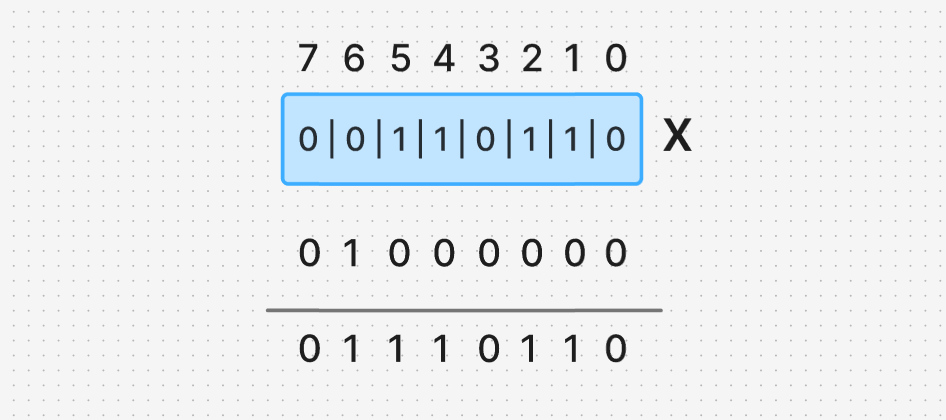

# **Note 1:** **" Set specific bit in a register "**
It means to set a specific bit to HIGH inside a byte without changing any other bit inside the same register, as an example bit number 6 


How can we achieve this?
This can be achieved by oring this bit with 1
So any bit we want to change to ONE then we or it with 1 and the rest of the bits will be ored with ZERO.



Applying this with code
```c
#include <stdio.h>
int main() {
    unsigned char x=52;
    x=x|64;
    printf("%i\n",x);
    return 0;
}
```
or with octal system
```c
#include <stdio.h>
int main() {
    unsigned char x=52;
    x=x|0100;
    printf("%i\n",x);
    return 0;
}
```
or with binary
```c
#include <stdio.h>
int main() {
    unsigned char x=52;
    x=x|0b01000000;
    printf("%i\n",x);
    return 0;
}
```
or with hexadecimal
```c
#include <stdio.h>
int main() {
    unsigned char x=52;
    x=x|0x40;
    printf("%i\n",x);
    return 0;
}
```
or we can achieve that by ONE shifted left by the number of bits
since we want to change the bit number 6 then we can just or the whole register with a one shifted left 6 times.
```c
#include <stdio.h>
int main() {
    unsigned char x=52;
    x=x|(1<<6); //we can remove parantheses as the left shift has higher precedence than the Bitwise OR
    printf("%i\n",x);
    return 0;
}
```
Now lets say that you want to change three bits at the same time
Bit number 6, bit number 4 and bit number 2. 
```c
#include <stdio.h>
int main() {
    unsigned char x=52;
    x|=(1<<6|1<<4|1<<2); 
    printf("%i\n",x);
    return 0;
}
```

# **Note 2: " Toggle a specific bit in a register "**
Toggling a bit is reversing its state, if it is 1 then we make it 0, if it's 0 then we make it 1 (Flipping it).
So We can achieve this by XORing the bit with 1.
So any bit we want to toggle it, then we can xor it with 1 and the rest bits be xored with 0 so they stay the same.
So if we want to toggle the bit number 5
```c
#include <stdio.h>
int main() {
    unsigned char x=36;
    x^=(1<<5);
    printf("%i\n",x);
    return 0;
}
```
Now lets say that you want to toggle three bits at the same time
Bit number 5, bit number 4 and bit number 2. 
```c
#include <stdio.h>
int main() {
    unsigned char x=52;
    x^=(1<<6|1<<4|1<<2); 
    printf("%i\n",x);
    return 0;
}
```


# **Note 3: " Clear a specific bit in a register "**
Clearing a bit means that we want to change a specific bit into ZERO, without changing any other bit
This can be achieved by anding the bit with zero and anding the rest with one.
We can not insert a zero inside some ones in the register
So We can insert a one inside zeros and inverting them by bitwise NOT.

As an example If we want to clear the 5th bit we can do that
```c
#include <stdio.h>
int main() {
    unsigned char x=52;
    x&=~(1<<5); 
    printf("%i\n",x);
    return 0;
}
```
Now lets say that you want to toggle three bits at the same time
Bit number 7, bit number 4 and bit number 2. 
```c
#include <stdio.h>
int main() {
	unsigned char x = 166;
	x &= ~((1<<2)|(<<4)|(1<<7));
	printf("x=%i\n", x);
	return 0;
}
```

# **Note 4: " Read a specific bit in a register "**
I only want to read a bit without even changing any bit
This can be achieved by ANDing the bit I want with One, and the rest bits will be ANDed with Zeros, and this data is stored in a new variable.


So I can check this inside a condition, If it is Zero I will make a code, and if not I will make another code.


Here I want to check the 5th bit if it is HIGH or LOW
```c
#include <stdio.h>

int main() {
    unsigned char x=32;
    
    if(x&1<<5) 
	    printf("This bit is HIGH\n");
	else
		printf("This bit is LOW\n");
    
    return 0;
}
```

but is this the best way to read a bit?
In the last example the conditions doesn't return 1, it returns 100000
as the 5th bit is HIGH,
I want the bit I am checking to be the least significant bit.
I can do that by 2 ways.

One is by right shifting after I finish.
```c
#include <stdio.h>

int main() {
    unsigned char x=32;
    
    if((x&1<<5)>>5) 
	    printf("This bit is HIGH\n");
	else
		printf("This bit is LOW\n");
    
    return 0;
}
```
The other is by right shifting it first then anding it with ONE
```c
#include <stdio.h>

int main() {
    unsigned char x=32;
    
    if((x>>5)&1) 
	    printf("This bit is HIGH\n");
	else
		printf("This bit is LOW\n");
    
    return 0;
}
```


# **Note 5: " Circular Shift Left "**
It is a bitwise operation that shifts all bits of a binary number to the left by a specified number of positions. The bits that are shifted off the left end "wrap around" and re-enter on the right end.

This is hard to be implemented as it is not supported by any operator.


Let's say that you want to circularly shift a number by 3
First we shift it left by 3
Then we shift it right by (register size - 3)
Then we Bitwise or them 
so we achieve that.


# **Note 6: " Circular Shift Right "**
It is a bitwise operation that shifts all bits of a binary number to the right by a specified number of positions. The bits that are shifted off the right end "wrap around" and re-enter on the right end.


Same as the circularly shift left
Let's say that we want to circularly shift right by 5
First we shift it left by 5
Then we shift it right by (register size - 5)
Then we Bitwise or them 

	# **Note 7: " Sizeof operator "**
It is a unary operator which returns the size of data in bytes.
It doesn't evaluate anything inside it
Meaning that the output of the following code will be 4 4, as it doesn't perform any operation happens inside it
```c
#include <stdio.h>
int main()
{
    int x=4,z;
    z=sizeof(++x);
    printf("Z=%i\nx=%i",z,x);
    return 0;
}

-------------------------------------
//-> 4
//-> 4

```


# **Note 8: " Unary Operator "**
It is any operator that deals with only 1 variable.


# **Note 9: " Comma Operator " **
```c
#include <stdio.h>
int main()
{
    int x;
    x=(5,6,7);
    printf("x=%i\n", x);
    return 0;
}

// it takes the right most and ignores the left
-----------------------------
//-> x=7
```
even if there is a statement inside, it will evaluate the statement

as an example
```c
#include <stdio.h>
int main()
{
    int x;
    x=(5,6,5,printf("ok\n"));
    printf("x=%i\n",x);
    return 0;
}

// it takes the right most, when it comes to the printf statement it counts how many characters in between the printf and the printf returns in it the length of the string it prints
--------------------------------------
//-> x=3
```

The `printf` function always execute then returns inplace the count of the characters it printed
```c
#include <stdio.h>
int main()
{
    printf("x=%i\n", printf("Hello world!\n"));
    return 0;
}

---------------------------
//-> Hello World!
//-> x=13
```

```c
#include <stdio.h>

int main() {
	int x;
	x=printf("%i\n", printf("Hello World!\n"));
	printf("x=%i\n", x);
	
	return 0;
}
---------------------------------------------------------------------
//-> Hello World!
//-> 12
//-> x=3
```
