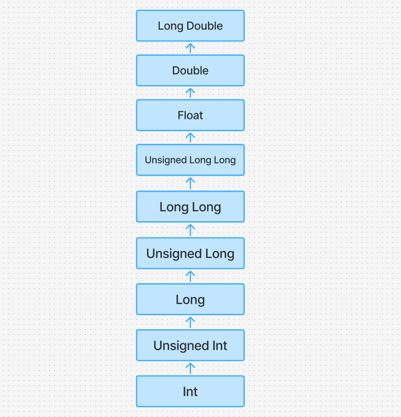
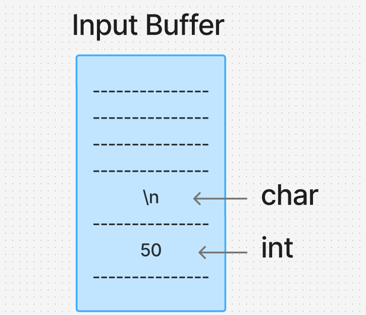
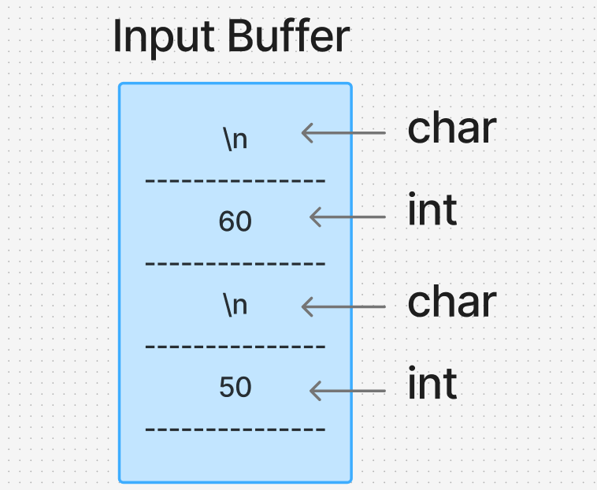

# **Note 1: " Swapping two vars without using third one "**
You can use two different techniques, one of them using the addition and subtraction\
like this
```c
#include <stdio.h>

int main () {
	int x=3, y=7;
	x=x+y; //x now is equal to 10
	y=x-y; //y now is equal to 3
	x=x-y; //x now is equal to 7

	return 0;
}
```

The second method is by using XOR as any number x xor itself is equal to zero, and any number x xor zero is equal the number itself
```c
#include <stdio.h>

int main () {
	int x=5, y=6; //notice that 5^6 = 3
	x=x^y; //the x now is 5^6
	y=x^y; //(5^6)^6 which is 5 so y=5
	x=x^y; //(5^6)^5 which is 6 so x=6

	return 0;
}
```

# **Note 2: " If condition bug "**
If you assign a number to a var, the compiler replaces this var by the number it's assigned to 
So as an example, `x=6` this statement is replaced by the compiler by 6
```c
#include <stdio.h>
int main() {
	int x;
	if(x=7) {
		printf("Hello");
	}
	 return 0;
}
---------------------------------------------------------------------
//-> Hello

It prints Hello as the x=7 statement is replaced by 7, and the compiler takes it as a true condition
```

```c
#include <stdio.h>
int main() {
	int x;
	if(x=0) {
		printf("Hello");
	}
	 return 0;
}
---------------------------------------------------------------------
//-> 

It prints nothing as the x=0 statement is replaced by 0, and the compiler takes it as a false condition
```

To be safe from this problem we write the number first then compare it to our variable
just like that
```c
#include <stdio.h>
int main() {
	int x=8;
	if(8==x) {
		printf("Hello");
	}
	 return 0;
}
---------------------------------------------------------------------
//-> Hello
```
why does this work? If I forgot to put another equal sign, it would gave me a syntax error
just like that
```c
#include <stdio.h>
int main() {
	int x=8;
	if(8=x) { //syntax error 8=x?
		printf("Hello");
	}
	 return 0;
}
---------------------------------------------------------------------
//-> 
```

```c
#include <stdio.h>
int main()
{
    if (printf("Ok\n")) //returns 3 
    {
        printf("Hello World!\n");
    }
    return 0;
}
-------------------------------------------------------------------
//-> Ok
//-> Hello World!
```

```c
#include <stdio.h>
int main()
{
    if (printf("")) //returns 0 
    {
        printf("Hello World!\n");
    }
    return 0;
}
-------------------------------------------------------------------
//-> 
```

So How we can print " Hello World! " without using any semicolon?
```c
#include <stdio.h>
int main()
{
    if (printf("Hello World!\n")) //returns 12 
    {
    }
    return 0;
}
-------------------------------------------------------------------
//-> Hello World!
```


# **Note 3: " Promotion "**
The Promotion is the automatic conversion of a **smaller data type** to a **larger data type** during an operation to avoid loss of information. 

As an example if we have: 
```c
#include <stdio.h>
int main()
{
    int x,y=5; char g=4;
    x=g+y; 
    /* In this statement the g is promoted to be an integer having 32 bytes to 
	complete the operation needed then it goes back into char. */
    return 0;
}
```

The Promotion usually happens inside the ALU meaning that if char is promoted into integer, it won't take more than its size in the RAM memory, it is temporarily int inside the ALU

Another Example:
```c
#include <stdio.h>
int main()
{
	signed char x=-64;
	signed short y;
	y=x<<2;
	printf("y=%i\n", y);
    return 0;
}
-------------------------------------------------------------------
//-> y=-256
```

What happens here is that the char is promoted into integer then it is stored in a short (y variable)
#### Promotion hierarchy:
Anything below int is promoted into int.



If we have a binary number that is unsigned and its formed like that
`111111111111111111111111111111111111111`
then the number in decimal is equal to 2^number of bites -1
so if it is 4 bytes, then the number is 2^32 -1

Another Example on Promotion:
```c
#include <stdio.h>
int main()
{
    signed int x=-1;
    unsigned int y=5;
    if(x<y) //x is promoted into unsigned int which means all the ones in it aren't considered as two's complement 
    {
	    printf("ok\n");
	} else {
		printf("not ok\n");
	}
    return 0;
}
-------------------------------------------------------
//-> not ok
```

but what happens if both of the vars are out of the hierarchy?
```c
#include <stdio.h>
int main()
{
    signed char x = -1;
    unsigned char y = 5;
    if (x < y) {
        printf("ok\n");
    } else {
        printf("not ok\n");
    }
    return 0;
}
-------------------------------------------------------
//-> ok
```
both of them here will be promoted into signed integer so there is no any problem.


#### **The main difference between the Promotion and the implicit data type casting is that promotion is always upgrading**


# **Note 4: " Float Promotion "**

```c
#include <stdio.h>

int main()
{
    int x = 5, y = 2;
    float z;
    z = x / y;
    printf("z=%f\n", z);
    return 0;
}
-------------------------------------------------------------------------
//-> 2.000000
What happens here is that the rValue is int / int which is stored in int rValue before it is stored in the float lValue
```

```c
#include <stdio.h>

int main()
{
    flaot x = 5, y = 2; //changed them to float
    float z;
    z = x / y;
    printf("z=%f\n", z);
    return 0;
}
-------------------------------------------------------------------------
//-> 2.500000
This solves the problem, but creates another one which is dealing with float numbers. Float numbers has some problems when dealing with bitwise operators and mod operator.
```

```c
#include <stdio.h>

int main()
{
    int x = 5, y = 2; 
    float z;
    z = (float) x / (float) y; //explicit typecast
    printf("z=%f\n", z);
    return 0;
}
-------------------------------------------------------------------------
//-> 2.500000
We solve this problem by explicitly typecasting them into float which just changes the data type of the rValue.
```

```c
#include <stdio.h>

int main()
{
    int x = 5, y = 2; 
    float z;
    z = (float) x / y; //explicit typecast
    printf("z=%f\n", z);
    return 0;
}
-------------------------------------------------------------------------
//-> 2.500000
Here one of them only is explicitly typecasted into float and the other is promoted into float from int.
```

# **Note 5: " Reading MSB bug "**
The normal in the following example that it will display `Msb is 1` as the 31's bit in number -2 in binary is ON, but what happens here is different
```c
#include <stdio.h>
int main()
{
    signed int x = -2;
    if ((((x & (1 << 31)) >> 31) == 1))
    {
        printf("Msb is 1\n");
    }
    else
    {
        printf("Msb is 0\n");
    }
    return 0;
}
-----------------------------------------------------------------------------
//-> Msb is 0
```
Any rValue is signed by default, so `1<<31` is a signed number, when we deal with signed here, we have a shift right, that has a special case with signed numbers, It inserts 1s in the most left bits instead of 0s, so the number will be 1111111111111111111111111111111111111111111
which is -1.
So if we change the code into `(((x & (1 << 31)) >> 31) == -1)` instead of comparing it with `1`, it will work.
```c
#include <stdio.h>
int main()
{
    signed int x = -2;
    if ((((x & (1 << 31)) >> 31) == -1))
    {
        printf("Msb is 1\n");
    }
    else
    {
        printf("Msb is 0\n");
    }
    return 0;
}
-----------------------------------------------------------------------------
//-> Msb is 0
```

#### This bug happens due to three reasons:
- Dealing with signed variable
- You are reading the Most Significant Bit
- The Most Significant Bit is 1, so the shift right inserts 1, but if the most significant bit is 0, it will work fine, as it won't insert 1s, it will insert 0s

**So, How can we solve this problem?**

First option, is by making the rValue of `1<<31` an unsigned rValue, this can be made bu adding `u` in the syntax like this `1u<<31`, so the code will be like this.
```c
#include <stdio.h>
int main()
{
    signed int x = -2;
    if ((((x & (1u << 31)) >> 31) == 1))
    {
        printf("Msb is 1\n");
    }
    else
    {
        printf("Msb is 0\n");
    }
    return 0;
}
-----------------------------------------------------------------------------
//-> Msb is 0
```
Here in this code, the x is promoted into unsigned int, which makes the shifting right has no special cases, just inserting zeros.


Second Option, is by using the other method of reading a bit.
```c
#include <stdio.h>
int main()
{
    signed int x = -2;
    if (((x>>31)&1))
    {
        printf("Msb is 1\n");
    }
    else
    {
        printf("Msb is 0\n");
    }
    return 0;
}
-----------------------------------------------------------------------------
//-> Msb is 0
```

# **Note 6: " Input Buffer Bug "**
This bug happens when you are scanning any datatype before scanning a char. 
```c
#include <stdio.h>

int main()

{
    signed int x,y;
    unsigned char operation;
    float result;
    printf("please enter the 2 numbers: ");
    scanf("%i%i",&x,&y);
    printf("please enter the operation: ");

    // fflush(stdin);

    scanf("%c",&operation);
    if(operation=='+')
    {
        result=x+y;
        printf("result=%f",result);
    }
    else if(operation=='-')
    {
        result=x-y;
        printf("result=%f",result);
    }
    else if(operation=='*')
    {
        result=x*y;
        printf("result=%f",result);
    }
    else if(operation== '/' )
    {
        if(y!=0)
        {
        result=(float)x/y;
        printf("result=%f",result);
        }
        else
        {
            printf("can't divide by 0");
        }
    }
    else if(operation=='%')
    {
        result=x%y;
        printf("result=%f",result);
    }
    else
    {
        printf("wrong operation");
    }
    return 0;
}
```
In this code, if you enter two numbers, the program immediately skips asking for the operator and prints “wrong operation.”


If we add a line to print the value stored in `operation` after the `else` block:
```c
else
    {
        printf("wrong operation");
    }
printf("%i\n", operation);
```
The output shows that `operation` holds the ASCII value **10**, which corresponds to `\n` (newline). This means the program read the Enter key you pressed as the operator.


##### **Why does this happen?**  
Your keyboard sends keystrokes more slowly than the CPU processes instructions, so there’s an **input buffer** between them. The input buffer stores everything you type until the program reads it.

Here’s what happens step-by-step:
1. When you run the program and it executes `scanf("%i", &x)`, it waits until there’s something in the input buffer and its datatype is the same as the scanned datatype.  
    If you type `50` and press Enter, the buffer will hold:    
    ```c
'5' '0' '\n'
```
    The `scanf("%i", &x)` reads the `50` (as an integer) and leaves `\n` in the buffer.
    
    
    
2. Next, `scanf("%i", &y)` is called.  
    It expects an integer, but the first thing in the buffer is `\n`, which isn’t a valid integer.  
    `scanf` ignores it and waits for the next integer.  
    When you type `60` and press Enter, the buffer becomes:
    ```c
'6' '0' '\n'
```
    Now `y` gets `60`, and the newline `\n` is still in the buffer.
    
	 
	 
    
3. Then `scanf("%c", &operation)` runs.  
    It reads **the very next character** from the buffer - which is `\n`- instead of waiting for you to type an operator.  
    That’s why `operation` becomes ASCII 10 (`\n`), triggering the “wrong operation” branch.


### **How can we solve this problem?**

- First Method to solve this problem is to scan the operation first, then scan the numbers.
  This will make the `\n` ignored as it is not a valid integer to be scanned.

- Second Method is by using this line `fflush(stdin);`
  (This is the most popular one)
  this line means that I order the processor to flush (erase) the input buffer,
  So it flushes the buffer before every time it is going to scan a variable.
  
- Third Method is by skipping white space characters,
  White space characters are any escape character like `\n` or any space character like " "
  This can be preformed by scanning the character with a space before the format specifier
  `scanf(" %c", &opr);` the space before the `%c` tells the processor to skip white space characters.
  So, When we are scanning chars from the user then we use this command.
  
  #### **But why `%i` already skips whitespace automatically but `%c` does not?**
  When you use a numeric format specifier like `%i`, `%d`, `%f`, etc., `scanf` **automatically skips any leading whitespace** before trying to read the number.

    ```c
'\n' '6' '0' '\n'
```

	`%i` will first skip over the `'\n'`, then read `"60"` as an integer.

	`%c` is different — it **does not skip whitespace**.  
		- a space `' '`
		- a newline `'\n'`
		- a tab `'\t'`
		- or any other whitespace

#### **Why this difference exists?**
- For numbers: It’s common for users to type spaces or press Enter before numbers, so C’s designers made numeric specifiers skip whitespace automatically.
- For characters: Sometimes you **actually want to read spaces, tabs, or newlines** as valid input.  
    For example, if you’re reading raw text, `" "` (two spaces) might be important data, so `%c` leaves whitespace handling up to you.


### This bug is handled in `cin>>` function of C++.


