#embedded-systems #microcontrollers #hardware #electronics

# What are Embedded Systems?
An embedded system is a combination of computer hardware and software designed to control a larger system or perform a dedicated function on an integrated circuit (IC).

Typically, an embedded system relies on an IC containing a processor, memory, General Purpose Input/Output (GPIO) pins, timers, counters, Analog-to-Digital Converters (ADCs), Digital-to-Analog Converters (DACs), and other components. When combined with external capacitors, resistors, transistors, and supporting ICs, this setup forms a complete Microcontroller Unit (MCU).

An Embedded Software Engineer writes programs on a PC and transfers ("burns") the compiled binary to the microcontroller's non-volatile memory using a hardware tool called a programmer.

A common challenge in embedded systems is noise sensitivity. This issue is mitigated by optimizing software quality and improving the PCB layout of the MCU board.

# Embedded Systems Categories
## Microcontrollers
Microcontrollers are produced by several key semiconductor companies, including:
- Microchip
- Atmel
- Intel
- Motorola

Other companies like Samsung and Philips also manufacture microcontrollers, though they are less commonly used in the general commercial hobbyist market compared to the ones listed above.

## Development Boards
Rather than manually designing a PCB to hold your microcontroller, programmer, and peripheral circuitry, you can use pre-assembled development boards like Arduino.

While Arduino (originally developed by the Arduino team as an open-source project) is highly accessible and easy to learn, it is rarely used in commercial, mass-produced industrial products. Industrial applications require custom-designed PCBs tailored to the specific size, power, and peripheral requirements of the project.

## FPGAs
A Field Programmable Gate Array (FPGA) is an integrated circuit containing unconfigured hardware blocks that can be programmed to implement any digital circuit.

Think of an FPGA as an empty apartment with no walls, where you decide exactly where to place every partition, hallway, or room. You define where to place counters, registers, and custom arithmetic units at the hardware level.

This differs fundamentally from microcontrollers. In an MCU, the processor has fixed, pre-designed internal hardware peripherals (like timers) that you configure using software registers. In an FPGA, you design the timer hardware manually using a Hardware Description Language (HDL) and then program the silicon to implement that hardware.

While FPGA development is complex and time-consuming, it offers a major advantage: you can rapidly prototype custom digital logic for Research and Development (R&D) or implement high-performance, specialized hardware accelerators (such as image processing modules or fingerprint scanners) that are not available as standard off-the-shelf ICs.

## SoCs
A System on Chip (SoC) - such as the Broadcom processor powering a Raspberry Pi - is an entire computer integrated onto a single silicon die. Boards built around SoCs function as full computers, capable of running a complete operating system (like Linux) and featuring built-in controllers for high-level peripherals such as HDMI screens, USB keyboards, mice, and RJ45 Ethernet ports.
# Microcontrollers
## Microcontroller Architecture
The architecture of a typical microcontroller contains the following core blocks:
1. **The Processor:**
    - ALU (Arithmetic Logic Unit)
    - Control Unit
    - Internal CPU Memory: Cache and Registers
        
2. **System Memory:**
    - RAM (Volatile):
        - SRAM (Static RAM)
        - DRAM (Dynamic RAM)
    
    - ROM (Non-Volatile):
        - ROM (Read-Only Memory)
        - PROM (Programmable ROM)
        - EPROM (Erasable PROM)
        - EEPROM (Electrically Erasable PROM)
        - Flash Memory
    
3. **I/O Pins**
4. **Peripheral Devices:**
    - Timers
    - Counters
    - ADC (Analog-to-Digital Converter)
    - DAC (Digital-to-Analog Converter)
    - Serial Communication Units (such as SPI, I2C, or UART)
    - USB Controller
    
5. **System Buses:**
    - Data Bus
    - Address Bus
    - Control Bus

## Microcontroller Features
A functional microcontroller requires or typically includes:
1. Power Supply Pins ($V_{DD}$/$V_{CC}$ and $V_{SS}$/GND)
2. Crystal Oscillator Pins (Clock Generator, which can be internal or external)
3. Reset Pin (A physical pin to reset the hardware execution)
4. Interrupt Controller
5. Timers/Counter
6. Watchdog Timer (WDT)
7. Analog-to-Digital Converter (ADC)
8. Analog Comparators
9. Serial Ports:
    - Synchronous (SPI, I2C)
    - Asynchronous (UART)
    
10. Brown-out Reset (BOR)    
11. Sleep/Low-Power Modes
12. LCD Driver
13. Code Protection/Security Bits
14. Low Power Consumption Design
15. Pulse Width Modulation (PWM) Generators
16. Flash Memory Endurance (typically up to 100,000 write/erase cycles)
17. IC Default Lifetime/Reliability Ratings
## PIC18F452
To understand how these features work, let's examine a specific microcontroller: the Microchip PIC18F452.

You might wonder: _Why not study an Atmel ATmega instead?_ The specific chip does not matter. You can learn embedded concepts on any processor family and apply the same foundational knowledge to another simply by adapting your code and understanding the target device's datasheet.

Historically, one of the notable differences between Microchip and Atmel microcontrollers was their hardware security; Microchip's code protection and encryption features were widely considered more robust.

The PIC18F452 is a 40-pin IC. 34 of these pins can function as General Purpose I/O (GPIO), while the remaining pins are dedicated to power, ground, the master reset, and clock oscillators.

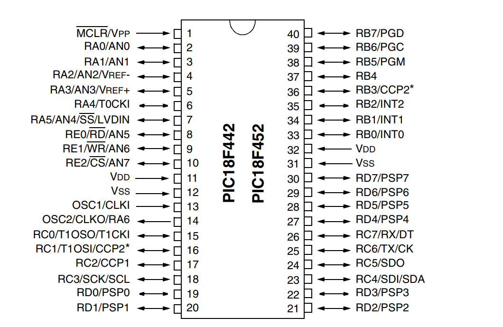
### General Pins
#### Reset Pin
The master reset pin is named $\overline{\text{MCLR}}$ (Master Clear). Located at Pin 1, it is an **active-low** pin. Applying a low voltage state (logic 0) to this pin resets the internal processor registers and starts program execution from address `0x0000`.

Most microcontroller architectures utilize active-low reset pins. Active-low configurations are more immune to electrical noise and voltage fluctuations than active-high configurations.

In active-low setups, a transition to Ground (0V) is highly distinct and immune to positive rail supply sag, ensuring the reset triggers reliably even if the system's power rail drops slightly. If a reset pin were active-high (requiring a logic high state of 5V to trigger), a temporary system voltage drop or signal degradation down to 3.7V might fail to register as a stable logic 1, preventing a reliable reset. Conversely, with an active-low configuration, pulling the signal to ground ($0\text{ V}$) ensures a reliable, unambiguous logical 0, regardless of the system's supply line fluctuations.

#### Oscillator Pins
Pins 13 and 14 are the oscillator interface pins, labeled OSC1 and OSC2.

Every microcontroller needs a stable clock signal to synchronize its instruction execution. This clock signal is generated by an oscillator circuit connected to these pins. There are three primary clock source options:

- **Crystal Oscillator (Quartz Crystal):**
    - Under mechanical pressure, a quartz crystal oscillates at an incredibly stable and precise frequency (piezoelectric effect).
    - Crystals are selected and purchased based on their rated oscillation frequency.
	
- **555 Timer IC:**    
    - An external integrated circuit configured as an astable multivibrator to generate a square wave pulse train.
    - The output frequency is adjusted by changing the values of the resistors and capacitors connected to the 555 timer.
    
- **Resistor-Capacitor (RC) Circuit:**    
    - A simple circuit where a capacitor is charged and discharged through a resistor.
    - This produces a primitive, less precise sawtooth or ramp-like clock waveform.
#### Power Supply Pins
- Pins 11 and 32 are designated as $V_{DD}$ (typically connected to +5V).
- Pins 12 and 31 are designated as $V_{SS}$ (connected to ground, 0V).

These power pins are duplicated on both sides of the IC (Pins 11/12 on the left, Pins 31/32 on the right) to simplify trace routing and improve power delivery when designing physical PCB layouts.

Since 7 pins are dedicated to non-I/O functions (2 for power, 2 for ground, 2 for oscillators, and 1 for reset), we are left with 33 physical pins. However, the PIC18F452 offers up to 34 I/O pins because one of the oscillator pins can be multiplexed to serve as a standard I/O pin under specific clock configurations.

### I/O Pins
The general-purpose input/output (GPIO) pins are organized into functional groups called **Ports**. Let us look at some of the key pin assignments and their multiplexed features.
#### Port A
Port A is a 7-bit port, with pins labeled RA0 through RA6.
##### RA0/AN0
Located at Pin 2, this pin is multiplexed as RA0/AN0. To minimize the physical pin count of the chip, multiple internal peripherals share the same physical pins. You configure which mode to use inside your software:
- **RA0:** Digital Input/Output pin 0 for Port A.
- **AN0:** Analog Input Channel 0 (for the ADC).
##### RA1/AN1
Located at Pin 3, this pin is multiplexed as RA1/AN1:
- **RA1:** Digital Input/Output pin 1 for Port A.
- **AN1:** Analog Input Channel 1.
##### RA2/AN2/Vref-
Located at Pin 4, this pin is multiplexed as RA2/AN2/Vref-:
- **RA2:** Digital Input/Output pin 2 for Port A.
- **AN2:** Analog Input Channel 2.
- **Vref-:** The negative voltage reference input for the ADC.
##### RA3/AN3/Vref+
Located at Pin 5, this pin is multiplexed as RA3/AN3/Vref+:
- **RA3:** Digital Input/Output pin 3 for Port A.
- **AN3:** Analog Input Channel 3.
- **Vref+:** The positive voltage reference input for the ADC.
###### Voltage References (Vref- and Vref+)
The internal Analog-to-Digital Converter (ADC) requires positive ($V_{\text{ref}+}$) and negative ($V_{\text{ref}-}$) reference voltage thresholds to scale and translate incoming analog voltages into digital steps.

This brings up a key design consideration: _If these pins must be connected to reference voltages to use the ADC, does that mean AN2 and AN3 are lost as analog input channels?_

Not necessarily. The reference voltages define the boundaries of your analog input range. If you are reading a sensor that outputs a standard 0V to 5V signal, you can configure the microcontroller in software to internally connect $V_{\text{ref}+}$ to $V_{DD}$ (5V) and $V_{\text{ref}-}$ to $V_{SS}$ (0V). This frees up Pin 4 and Pin 5 to be used as standard analog input channels (AN2 and AN3), giving you access to all 8 ADC channels.

However, if your sensor operates on a custom voltage range, your available ADC channels change:
- **0V to 3.3V Sensor:** Configure $V_{\text{ref}-}$ internally to $V_{SS}$, but route an external 3.3V source to $V_{\text{ref}+}$ (Pin 5). You lose AN3, leaving you with 7 available analog channels.
- **2V to 5V Sensor:** Configure $V_{\text{ref}+}$ internally to $V_{DD}$, but route an external 2V source to $V_{\text{ref}-}$ (Pin 4). You lose AN2, leaving you with 7 available analog channels.
- **2V to 7V Sensor:** Route 2V to $V_{\text{ref}-}$ (Pin 4) and 7V to $V_{\text{ref}+}$ (Pin 5). You lose both AN2 and AN3, leaving you with 6 available analog channels.

In summary, the PIC18F452 can provide up to 8 analog input channels depending on how you configure its ADC references.
##### RA4/T0CKI
Located at Pin 6, this pin is multiplexed as RA4/T0CKI:
- **RA4:** Digital Input/Output pin 4 for Port A.
- **T0CKI:** Timer0 External Clock Input.

The distinction between a timer and a counter depends on the clock source. A **timer** counts pulses from the microcontroller's internal, synchronous system clock. A **counter** counts external, asynchronous pulses.

By routing an external sensor or pulse-generating circuit to the T0CKI pin, you can configure the internal Timer0 module to act as a counter, logging external events asynchronously.
##### RA5/AN4
Located at Pin 7, this pin is multiplexed as RA5/AN4 (labeled as AN4/RA5 in some documents):
- **RA5:** Digital Input/Output pin 5 for Port A.
- **AN4:** Analog Input Channel 4.
##### RA6/OSC2
Located at Pin 14, this pin is multiplexed as RA6/OSC2:
- **RA6:** Digital Input/Output pin 6 for Port A.
- **OSC2:** Crystal oscillator output pin.

If you use a single-ended external clock source (like an RC circuit or a 555 timer) connected to OSC1, the OSC2 pin is not required for the clock. In these configurations, Pin 14 can be reclaimed and used as a standard digital I/O pin (RA6). This is why the microcontroller can offer 34 I/O pins instead of 33.

#### Port B
Port B is an 8-bit port, with pins labeled RB0 through RB7.
##### RB0/INT0
Located at Pin 33, this pin is multiplexed as RB0/INT0:
- **RB0:** Digital Input/Output pin 0 for Port B.
- **INT0:** External Interrupt Input 0.

This microcontroller supports up to 17 distinct interrupt sources. These are split between **internal interrupts** (generated by on-chip peripherals like timers or ADC conversions) and **external interrupts** (triggered by voltage changes on physical pins). INT0, INT1, and INT2 are the primary hardware-vectored external interrupt pins.

##### RB1/INT1
Located at Pin 34, this pin is multiplexed as RB1/INT1:
- **RB1:** Digital Input/Output pin 1 for Port B.
- **INT1:** External Interrupt Input 1.
##### RB2/INT2
Located at Pin 35, this pin is multiplexed as RB2/INT2:
- **RB2:** Digital Input/Output pin 2 for Port B.
- **INT2:** External Interrupt Input 2.
##### RB3
Located at Pin 36, this is a dedicated digital I/O pin (RB3) for Port B.
##### RB4-RB7
Pins 37, 38, 39, and 40 can function as general-purpose digital I/O pins or be configured for the **Interrupt-on-Change (IOC)** feature, which triggers a processor interrupt whenever a state transition (high-to-low or low-to-high) occurs on any of these four pins.
#### Port C
Port C is an 8-bit port, with pins labeled RC0 through RC7.
##### RC0/T1CKI
Located at Pin 15, this pin is multiplexed as RC0/T1CKI:
- **RC0:** Digital Input/Output pin 0 for Port C.
- **T1CKI:** Timer1 Clock Input, allowing Timer1 to function as an external hardware counter.
##### RC1/CCP2
Located at Pin 16, this pin is multiplexed as RC1/CCP2:
- **RC1:** Digital Input/Output pin 1 for Port C.
- **CCP2:** Capture/Compare/PWM Module 2.
##### RC2/CCP1
Located at Pin 17, this pin is multiplexed as RC2/CCP1:
- **RC2:** Digital Input/Output pin 2 for Port C.
- **CCP1:** Capture/Compare/PWM Module 1.

**What is a CCP (Capture/Compare/PWM) pin?**
- **Capture:** Records the value of an internal timer when an external event occurs on the pin (useful for measuring pulse widths or frequencies).

 - **Compare:** Constantly compares an internal timer value against a pre-set register and toggles the pin state when they match (useful for precise waveform generation).
  
- **PWM (Pulse Width Modulation):** Generates high-frequency square waves with variable duty cycles (commonly used to control motor speeds or LED brightness).

##### RC3-RC7
These function as standard digital I/O pins.
#### Port D
Port D is an 8-bit port, with pins labeled RD0 through RD7. They function as standard digital I/O pins.
#### Port E
Port E is a 3-bit port, with pins labeled RE0 through RE2.
##### RE0/AN5
Located at Pin 8, this pin is multiplexed as RE0/AN5:
- **RE0:** Digital Input/Output pin 0 for Port E.
- **AN5:** Analog Input Channel 5.
##### RE1/AN6
Located at Pin 9, this pin is multiplexed as RE1/AN6:
- **RE1:** Digital Input/Output pin 1 for Port E.
- **AN6:** Analog Input Channel 6.
##### RE2/AN7
Located at Pin 10, this pin is multiplexed as RE2/AN7:
- **RE2:** Digital Input/Output pin 2 for Port E.
- **AN7:** Analog Input Channel 7.
# Hardware Circuits
Every functional microcontroller board requires five essential support circuits:
- Power Circuit
- Reset Circuit
- Oscillator Circuit
- Input Circuit
- Output Circuit

If any one of these circuits is poorly designed or fails, the microcontroller will not run, which is a common source of confusion for beginners troubleshooting custom hardware.

## Power Circuit
Because the PIC18F452 requires a stable +5V DC power supply, we typically power it in one of two ways:
### DC Batteries
Batteries are ideal for portable applications. They provide clean, low-noise DC voltage, but they eventually deplete and require recharging or replacement.
### AC-to-DC Converter
For non-portable, mains-powered designs, an AC-to-DC converter is preferred. While commercial plug-in wall adapters (converting 220V AC down to 5V DC) are convenient, professional board designs often integrate the power regulation circuitry directly onto the PCB.

A standard linear AC-to-DC converter circuit contains:
- A step-down transformer
- A diode bridge rectifier
- A smoothing capacitor
- A voltage regulator

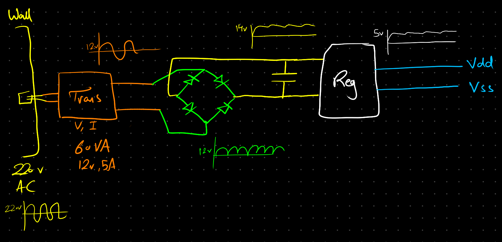

Let's look at each component in detail:
#### Transformer
Transformers are selected based on their output voltage ($V$), rated output current ($I$), or their overall Power Rating ($VA$, Volt-Amps, which is the product of voltage and current). For example, we might select a 12V, 5A (60VA) step-down transformer.
- **Before the transformer:** The signal is a high-voltage, 220V AC sinusoidal wave.
- **After the transformer:** The signal is stepped down to a safer 12V AC sinusoidal wave.

---
#### Rectifier
You can build a full-wave rectifier using four discrete diodes, or purchase a pre-packaged bridge rectifier component.

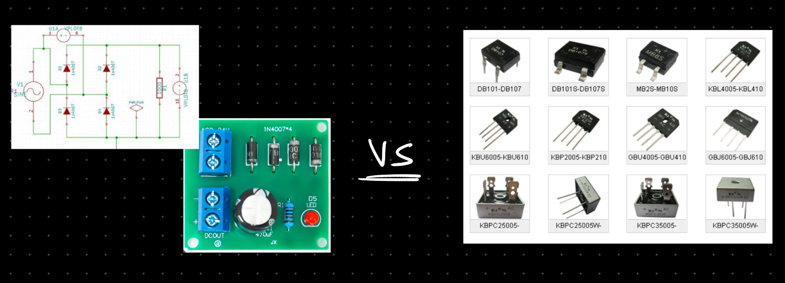

Both approaches are functionally identical. However, pre-packaged bridge rectifiers (right) save PCB space and assembly time because they require soldering only 4 pins instead of 8. On the other hand, using discrete diodes (left) makes troubleshooting cheaper: if a single diode fails, you only need to replace that individual diode rather than the entire bridge package.
#### Smoothing Capacitor
A large capacitor is placed in parallel with the rectifier output. It acts as a low-pass filter, smoothing out the pulsating DC voltage by storing energy during the rising edge of the voltage wave and discharging to supply current during the falling edge.
##### How do we choose the right capacitor type?
There are four primary capacitor families used in electronic designs:
- Aluminum Electrolytic (Chemical)
- Film
- Ceramic
- Tantalum
###### **Electrolytic Capacitors:**
- **Insulator:** Liquid or gel electrolyte.
- **Polarity:** Polarized (must be oriented correctly with positive and negative terminals; DC only).
- **Characteristics:** High capacitance density (typically $1000\ \mu\text{F}$ to $2200\ \mu\text{F}$ in power filtering) and high voltage ratings.

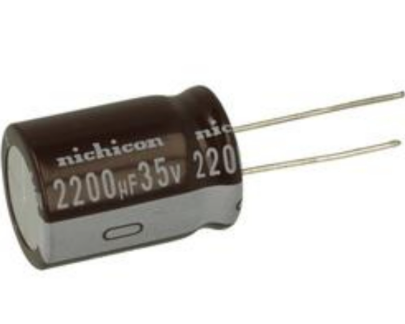

Used for low-frequency power supply ripple filtering immediately following a bridge rectifier, bulk energy storage, and audio amplifier power stages.
###### **Film Capacitors:**
- **Insulator:** Thin plastic film (polyester, polypropylene).
- **Polarity:** Non-polarized (can be used in AC and DC circuits).
- **Characteristics:** Highly stable capacitance values, low leakage current, and low self-inductance. Capacitance values are typically small (pF to nF ranges).

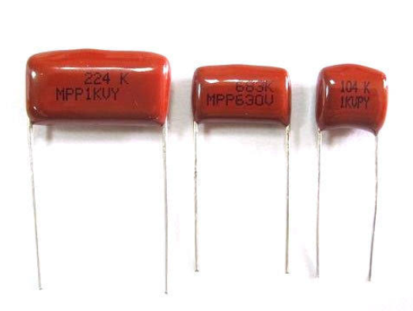

Used in precision timing circuits, analog filters, AC line filtering, and audio coupling.
###### **Ceramic and Mica Capacitors:**
- **Insulator:** Ceramic dielectric or natural mica.
- **Polarity:** Non-polarized.
- **Characteristics:** Excellent high-frequency performance, very low Equivalent Series Resistance (ESR), and high voltage options. Capacitance values are small to moderate (pF to $\mu\text{F}$ ranges).

**Ceramic:**

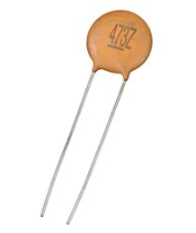

**Mica:**

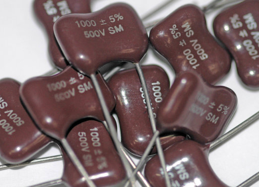

Used for high-frequency bypass/decoupling placed right next to IC power pins to filter out high-frequency switching noise, as well as in RF and tuning circuits.
###### **Tantalum Capacitors:**
- **Insulator:** Solid tantalum manganese dioxide.
- **Polarity:** Polarized (extremely sensitive to overvoltage and reverse polarity).
- **Characteristics:** High volumetric efficiency (large capacitance in a very small physical package), highly stable over time and temperature, and lower ESR than standard aluminum electrolytics.

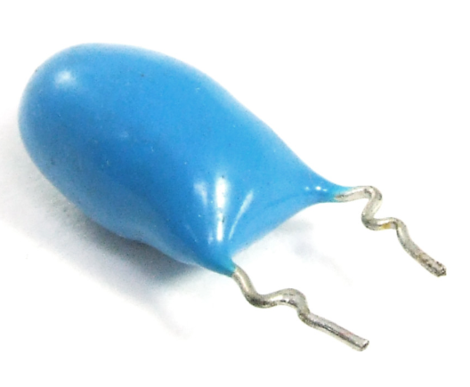

Used for bulk decoupling near voltage regulators in space-constrained layouts where high reliability and stable filtering are required.
##### **Quick Selection Logic:**
- **High-capacity bulk filtering (DC only):** Use **Electrolytic**.
- **Precision, stability, and AC/DC timing:** Use **Film**.
- **High-frequency noise decoupling (near ICs) / small values:** Use **Ceramic**.
- **Compact size + stable bulk capacitance:** Use **Tantalum** (ensuring proper voltage derating).

For the mains input stage of our AC-to-DC converter circuit, we select a polarized **Electrolytic Capacitor** for bulk ripple filtering.

---
#### Voltage Regulator
After the smoothing capacitor, the unregulated DC voltage will still ripple, often sitting slightly above 12V (e.g., 13V to 14V). To step this voltage down to a clean, stable +5V DC, we use a linear voltage regulator like the LM7805. The regulator maintains a steady 5V output by dissipating any excess voltage drop ($V_{\text{in}} - V_{\text{out}}$) as heat, which often requires attaching a metal heat sink.

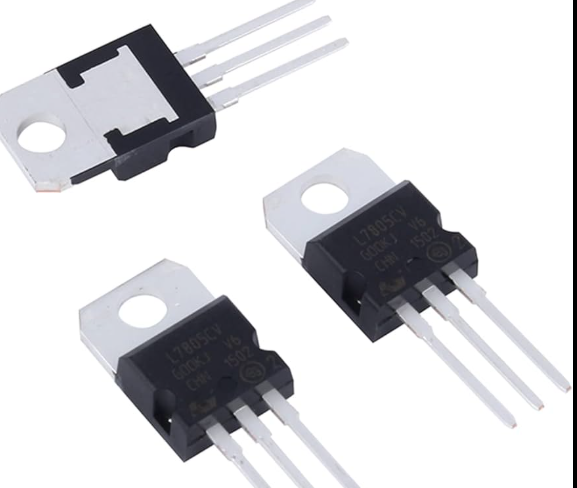

---
## Reset Circuit
As noted earlier, the PIC18F452's $\overline{\text{MCLR}}$ reset pin is active-low. The processor remains in reset as long as this pin is tied to ground (0V).

To implement a manual reset button, we can connect a momentary push-button switch between $\overline{\text{MCLR}}$ and ground. When the button is pressed, $\overline{\text{MCLR}}$ is pulled low, resetting the microcontroller.

However, a naive switch connection causes a major electrical issue: When the button is released, the pin is completely disconnected from any voltage source.

The PIC18F452 is manufactured using TTL (Transistor-Transistor Logic) input thresholds. In digital logic, pins cannot be left "floating" in a high-impedance state. A floating copper trace behaves like an antenna, picking up electromagnetic interference (EMI) from the environment. This causes the pin voltage to bounce unpredictably between logic 1 and logic 0, resulting in spontaneous, erratic system resets.

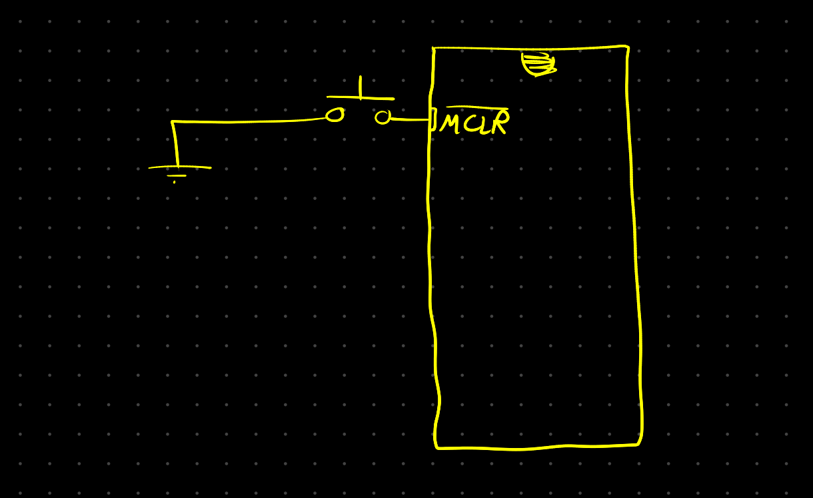

To prevent a floating input, we must implement a **pull-up resistor** circuit:
- When the button is **released**, the $\overline{\text{MCLR}}$ pin is tied through a resistor (typically $10\text{ k}\Omega$) to $V_{DD}$ (5V). This guarantees a stable logic 1 state, keeping the microcontroller running normally.
- When the button is **pressed**, current flows directly from the pin to ground. Because the ground path has zero resistance compared to the pull-up resistor path, the pin is pulled cleanly to 0V (logic 0), triggering a stable reset without short-circuiting the power supply.

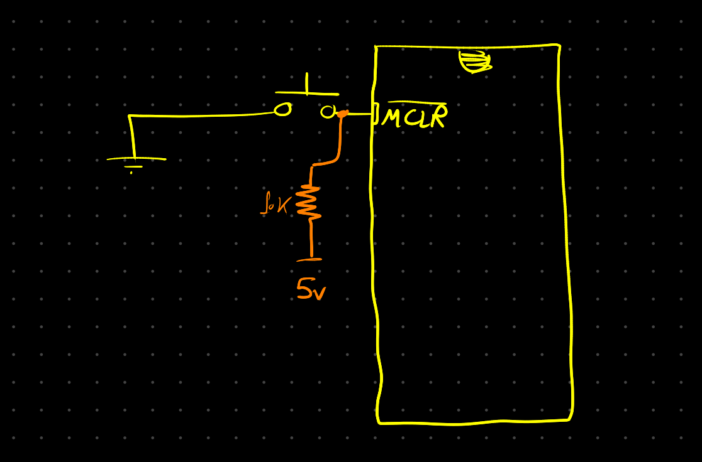

_(Note: CMOS logic inputs are similarly susceptible to damage and erratic behavior from floating inputs, and also require pull-up or pull-down resistors to enforce stable logic states)._

---
## Oscillator Circuit
We can implement the clock system using one of three external circuit options:
### Crystal Oscillator Circuit
This circuit utilizes both OSC1 (Pin 13) and OSC2 (Pin 14) pins. Consequently, Pin 14 is dedicated to the clock and cannot be used as RA6, leaving you with 33 available GPIO pins.

To ensure stable oscillation, you must connect two small ceramic load capacitors (typically $22\text{ pF}$ to $33\text{ pF}$, as specified by the manufacturer's datasheet) between the crystal terminals and ground.

**Typical Crystal Oscillator Connection:**

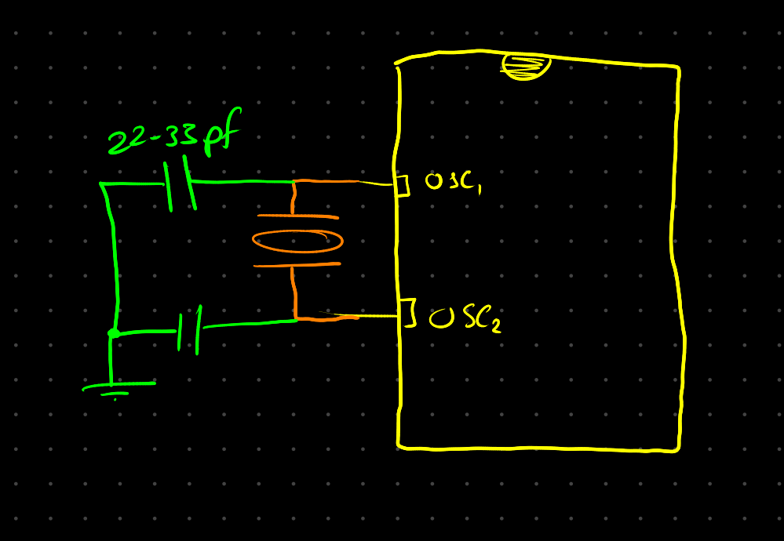

**Datasheet Reference Connections:**

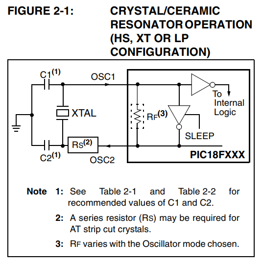

You must configure the microcontroller's internal configuration fuses to match the frequency of your crystal:
- **LP (Low Power):** For low-frequency crystals ($32\text{ kHz}$ to $200\text{ kHz}$).
- **XT (Standard Crystal):** For mid-range frequencies ($1\text{ MHz}$ to $4\text{ MHz}$).
- **HS (High Speed):** For high-frequency resonators ($4\text{ MHz}$ to $25\text{ MHz}$).
- **HS + PLL:** Enables an internal Phase-Locked Loop frequency multiplier to boost high-frequency crystal speeds (typically multiplying the crystal by 4 up to a max of $40\text{ MHz}$).
### External Clock Generator
If you use an external active clock generator (such as an astable 555 timer or a canned oscillator), you feed the single clock signal directly into OSC1 (Pin 13).
Because OSC2 (Pin 14) is not required to drive the oscillation, it can be freed up. You configure the clock behavior in software:
- **EC (External Clock):** Pin 14 outputs the internal instruction cycle clock ($F_{\text{OSC}}/4$) for monitoring or cascading.
- **ECIO:** Pin 14 is disabled as a clock output and functions as standard digital I/O pin RA6.

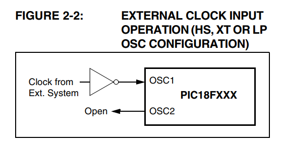
### RC Clock Generator
For low-cost, non-precision applications, a simple Resistor-Capacitor (RC) network can act as the clock source. The RC junction connects to OSC1 (Pin 13).
Similar to the External Clock mode, OSC2 (Pin 14) can be configured in two ways:
- **RC:** Pin 14 outputs the instruction cycle clock ($F_{\text{OSC}}/4$).
- **RCIO:** Pin 14 is freed to function as standard digital I/O pin RA6.

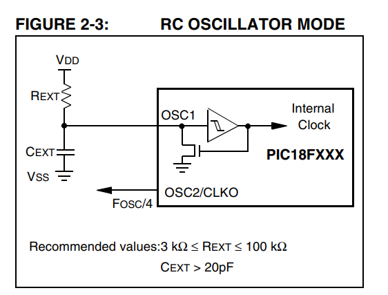
### Configuration Summary
The PIC18F452 oscillator mode is configured using three non-volatile configuration bits: `FOSC2`, `FOSC1`, and `FOSC0`. These select from the eight primary operating modes:

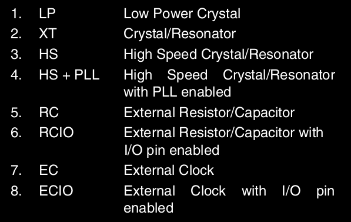

---
## Input Circuit
When interfacing digital inputs like momentary switches to a microcontroller, you must use pull-up or pull-down resistors to prevent pins from floating when the switch is open.
- **Active-Low Configuration (Pull-Up Resistor):** Pin connects to 5V through a resistor. Pressing the switch shorts the pin to ground.
- **Active-High Configuration (Pull-Down Resistor):** Pin connects to ground through a resistor. Pressing the switch shorts the pin to 5V.

Let's analyze what happens without these resistors:
- **Left Switch (Intended Active-Low):** Pressing the switch grounds Pin 1 (logic 0). Releasing the switch leaves Pin 1 completely disconnected, creating an unpredictable floating state.
- **Right Switch (Intended Active-High):** Pressing the switch connects Pin 2 to 5V (logic 1). Releasing the switch leaves Pin 2 completely disconnected, creating an unpredictable floating state.

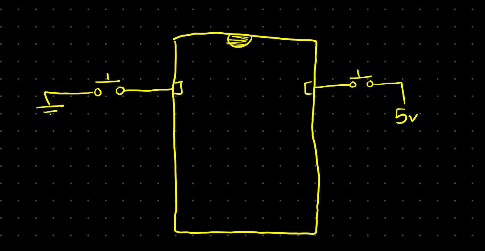

Adding pull resistors guarantees stable logic transitions:
- **Active-Low with Pull-Up (Left):**
    - **Switch Open:** Current flows through the resistor to the pin, pulling it securely to $V_{DD}$ (logic 1).
    - **Switch Closed:** The pin is connected directly to ground. Current from $V_{DD}$ passes through the resistor to ground, pulling the pin cleanly to 0V (logic 0) without any voltage drop.
    
- **Active-High with Pull-Down (Right):**    
    - **Switch Open:** The pin is tied directly to ground through the resistor, pulling it securely to 0V (logic 0).
    - **Switch Closed:** The pin is connected directly to $V_{DD}$, overriding the high-resistance path to ground and pulling the pin to 5V (logic 1).        

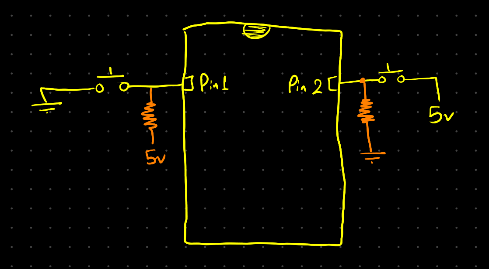

---
## Output Circuit