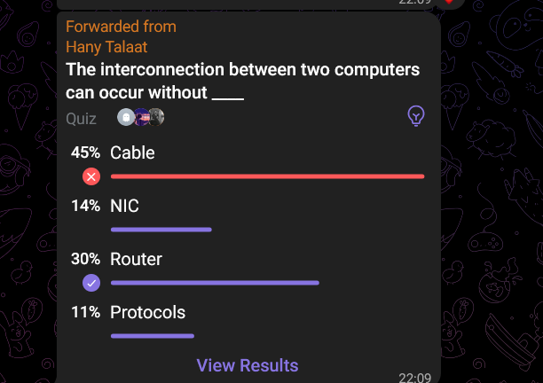

# **Note 1: " Switch constraints "**
The switch case can not have its condition (expression) of float data type, it must be an integer or enum, and the case can not be variable 
variable, it must be const variable.
It cannot be a normal variable, it must be a constant one.


## Why does this happen?
The switch is faster than normal if condition as it doesn't check every condition in series till it find the working one, it just search which condition matches and executes it.
It makes that by collecting every case in a table before runtime, then searching for the right one.
So we can not put a case with a variable var, it must be const, can not be changed during runtime.
```c
#include <stdio.h>

int main() {
	int x=1;
	int y=2; //not const
	switch(x) {
			case 5:
			print("It is 5.\n");
			break;
		
		case 3:
			printf("It is 3.\n");
			break;
		
		case y: //error here "Expression must have constant value"
			printf("It is y.\n");
			break;
		
		default:
			break;
	}
	return 0;
}
```

# **Note 2: " Switch Tricks "**

## A. Nested `switch`:
It is having another `switch` inside a `case` of the outer `switch`.
May be a `nested if switch` or a `nested if switch`.
## B. What if I want to print "Ok" if my variable is 5 or 6,:
Using the if condition will be like this `if(6==x||5==x) printf("Ok\n");` , What if I want to implement the same logic using switch cases?
```c
#include <stdio.h>

int main() {
	int x=1;
	switch(x) {
		case 5:
		case 6:
			printf("Ok\n");
			break;
			
		default:
			break;
	}
	return 0;
}
```

## C. What if I want to print "Ok" if (x>5 || y<6) using `switch`:
```c
#include <stdio.h>

int main() {
	int x=1, y=9;
	switch(x>5||y<6) { //it checks on the number held in between its braces
		case 1:
			printf("Ok\n");
			break;
		case 0:
			printf("Not Ok\n");
			break;
	}
	return 0;
}
```
So you can enter any condition here, but there's a problem, sometimes some conditions you may write doesn't have to return 1 as a true condition otherwise the 0 is the only number that means false, so you need to specify the 0 condition as a `case` and any other thing is true.
```c
#include <stdio.h>

int main() {
	int x=1, y=9;
	switch(x>5||y<6) {
		
		case 0:
			printf("Not Ok\n");
			break;
			
		default:
			printf("Ok\n");
			break; // We don't have to put this break as there is no more cases
	}
	return 0;
}
```

## D. Default can be held in any place inside the `switch`:
```c
#include <stdio.h>

int main() {
	int x=1;
	switch(x) {
		default:
			break; // We have to put this break as there is more cases
			
		case 5:
		case 6:
			printf("Ok\n");
			break;
	}
	return 0;
}
```

## E. What if I want to check if my variable is in a specified range:
```c
#include <stdio.h>

int main() {
	int x=5;
	switch(x) {
		default:
			break; // We have to put this break as there is more cases
			
		case 5 ... 100:
			printf("Ok\n");
			break;
	}
	return 0;
}
```
Those three dots means that is between that range inclusive (5 and 100 included in this range)

### What if I overlapped ranges:
```c
#include <stdio.h>

int main() {
	int x=5;
	switch(x) {
		default:
			break; // We have to put this break as there is more cases
			
		case 5 ... 100:
			printf("Ok\n");
			break;
		case 1 ... 10:
			printf("Yes\n");
			break;
	}
	return 0;
}
```
this will give an error called overlapping, it won't compile.


# **Note 3: " Precedence "**
```c
#include <stdio.h>
int main() {
    int i, sum = 0, x;
    printf("please enter five numbers:\n");
    for (i = 0; i <= 4; i++) { 
        scanf("%i", &x);
        if (x & 1 == 0) { //it will check 1 == 0 first
            sum = sum + x;
        }
    }
    printf("sum=%i\n", sum);
    return 0;
}
```
Is 1 == 0? No, then the condition will be 0, so we are anding with 0 which is a mess.
```c
#include <stdio.h>
int main() {
    int i, sum = 0, x;
    printf("please enter five numbers:\n");
    for (i = 0; i <= 4; i++) { 
        scanf("%i", &x);
        if ((x & 1 )== 0) {
            sum = sum + x;
        }
    }
    printf("sum=%i\n", sum);
    return 0;
}
```
This is the right way.

# **Note 4: " For loop bug "**
If you see this code, it will run infinitely, as the `i >> 1` is not stored in the i. It must be `i >>= 1`
```c
#include <stdio.h>

int main() {
    int i = 8, counter = 0;
    for (; i; i >> 1) {
        counter++;
    }
    printf("%i", counter);
    return 0;
}
```

In this code it will iterate 6 times 
```c
#include <stdio.h>

int main() {
    int i,j;
    for (i=0, j=0; i<3,j<5; i++, j++) {
        counter++;
    }
    printf("%i", counter);
    return 0;
}
```
as the comma operator in the condition section only takes what is on the right`i<3,j<5`.


# **Note 5: " Infinite loop? "**
## A. Is this an infinite loop:*
This code here is not entering an infinite loop
```c
#include <stdio.h>
int main() {
    unsigned int i = 500;
    while (i++ != 0);
    printf("i=%u", i);
    return 0;
}
```
When the `i` overflows it will reset into 0, so the condition will be `0!=0` which is false and breaks the loop.

## B. Another form of infinite loop:
Okay here in this code it is `unsigned` which means that it will overflow to `255` instead of `1` 
```c
#include <stdio.h>

int main() {
    unsigned char x;
    for (x = 5; x >= 0; x--) {
        printf("ok\n");
    }
    return 0;
}
```
We can solve this using explicit casting into `signed char.
```c
#include <stdio.h>

int main() {
    unsigned char x;
    for (x = 5; (signed char) x >= 0; x--) {
        printf("ok\n");
    }
    return 0;
}
```


## C. Another form of infinite loop:
This is a form of infinite loop as it is `unsigned char` which will be 0 after incrementing 255.
```c
#include <stdio.h>

int main() {
    unsigned char x;
    for (x = 5; x <= 255; x++) {
        printf("ok\n");
    }
    return 0;
}
```

# **Note 6: " 35:04 "**